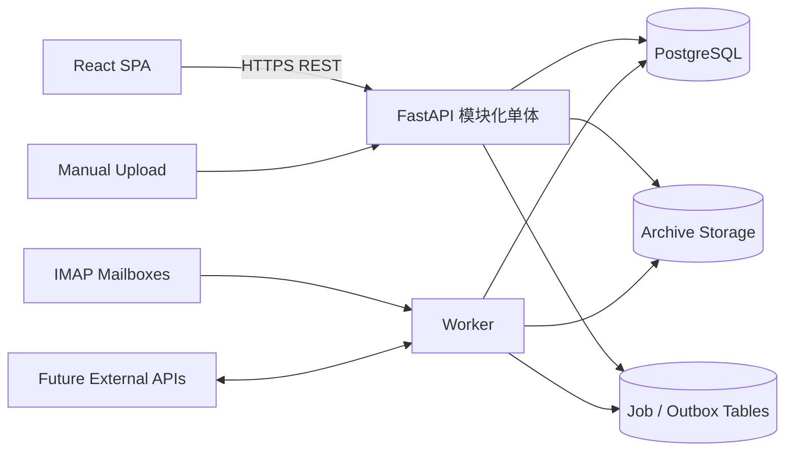

# 基金运营工作台 V2：后端架构与开发规范

> 本文规定正式后端的模块边界、API、事务、权限、数据模型、后台任务、文件归档、迁移、安全和测试要求。
>
> 当前 FastAPI 应用已经实现 NAV 第一阶段核心链路。本规范要求渐进拆分模块，不允许借架构调整重写或弱化已经存在的租户隔离、不可变证据、有效版本和并发控制。

---

## 1. 目标与非目标

### 1.1 目标

后端应做到：

1. 业务数据始终处于正确管理人边界；
2. NAV、材料、异常、权限和生命周期变更具备强一致性和完整审计；
3. 业务模块可以独立理解、测试和演进；
4. API 合同明确，可生成可靠的前端类型；
5. 邮件和文件解析异步、幂等、可重试、可观察；
6. 原始证据和历史业务事实不可被新版本覆盖；
7. 数据库约束承担关键唯一性和跨租户防护；
8. 新领域以真实案例垂直实现，不建设万能流程或万能数据模型；
9. 生产部署可备份、恢复、监控和安全升级；
10. 模块化单体在确有运行指标前不拆分微服务。

### 1.2 非目标

当前阶段不建设：

- 微服务、服务网格和分布式事务；
- Kafka、RabbitMQ 等消息基础设施；
- 通用工作流引擎；
- 万能 Data、万能 BusinessCase 或 EAV 模型；
- 完整 TA、估值、支付和交易系统；
- GraphQL；
- 多活或跨地域部署；
- 仅凭抽象设计预建投资者全量数据表。

---

## 2. 当前基线与主要问题

### 2.1 当前技术基线

| 类别 | 当前选择 |
|---|---|
| Web 框架 | FastAPI |
| 数据验证 | Pydantic |
| ORM | SQLAlchemy 2 |
| 数据迁移 | Alembic |
| 生产数据库 | PostgreSQL 17 |
| 本地调试数据库 | SQLite |
| 后台任务 | 独立 Python Worker + 数据库任务表 |
| 邮件 | IMAPClient，只读同步 |
| 文件解析 | openpyxl、xlrd、pypdf、自有托管适配器 |
| 身份认证 | 服务端 Session + HttpOnly Cookie |
| 密码 | Argon2 |
| 邮箱凭据 | Fernet 加密 |
| 文件存储 | 受控文件目录/持久卷 |
| 部署 | Docker Compose + Nginx + Uvicorn |
| 测试 | pytest、SQLite、隔离 PostgreSQL 并发测试 |

### 2.2 已有关键能力必须保留

- 管理人边界和跨牌照只读规则；
- 用户本人账号审计；
- 原始 EML 和附件归档；
- 哈希校验和同内容去重；
- NAV 候选只追加；
- EffectiveNav 独立有效指针；
- 冲突、反账和 revision 并发控制；
- PostgreSQL `FOR UPDATE SKIP LOCKED` 任务领取；
- 文档、NAV 和审计表的数据库不可更新/删除保护；
- 邮件 `readonly=True` 与 `BODY.PEEK[]`；
- 真实产品未确认前不自动建档；
- 已清算产品历史资料继续保留。

### 2.3 当前结构问题

1. `main.py` 同时承担应用装配、依赖、权限辅助、序列化和全部路由。
2. `services.py` 同时包含归档、生命周期、NAV、解析、异常和统计。
3. 所有 ORM 模型集中在 `models.py`，新增领域后会产生高耦合。
4. 大量接口返回动态 dict，OpenAPI 无法完整表达响应合同。
5. 错误响应主要依赖中文字符串，缺少稳定错误码和请求追踪 ID。
6. ParseJob 只有简单状态，重试次数、退避、租约和失败分类尚不完整。
7. 文件归档直接依赖本地 Path，未来切换 NAS/对象存储需要抽象边界。
8. Audit 与未来业务 Event、Decision 尚未分开。
9. Product 上的 NAV 应收字段只能表达一类应收预期。

---

## 3. 总体技术架构



### 3.1 部署单元

当前保留三个运行角色：

- `web`：Nginx，同源反向代理；
- `api`：FastAPI，同步请求和静态前端；
- `worker`：邮箱同步、文件解析、缺件检查和未来异步任务；
- `db`：PostgreSQL；
- `archive`：文件持久卷、NAS 或未来对象存储。

API 和 Worker 使用同一版本代码和数据模型，避免协议漂移。

### 3.2 模块化单体

模块化单体意味着：

- 一个应用部署版本；
- 一个主数据库；
- 按领域划分内部模块；
- 模块通过公开应用服务协作；
- 事务可以覆盖同一业务操作涉及的多个模块；
- 不允许任意跨模块写表。

它不是把所有路由、模型和业务逻辑继续放在三个大文件中。

---

## 4. 目标目录结构

```text
backend/app/
├─ main.py                    # ASGI 入口，仅导出 app
├─ bootstrap.py               # create_app、配置和模块装配
├─ config.py
├─ db.py
├─ common/
│  ├─ errors.py               # 稳定错误码和异常映射
│  ├─ ids.py
│  ├─ time.py
│  ├─ pagination.py
│  ├─ files.py                # Storage 接口
│  └─ observability.py
├─ auth/
│  ├─ models.py
│  ├─ schemas.py
│  ├─ service.py
│  ├─ dependencies.py
│  └─ router.py
├─ organization/
│  ├─ models.py
│  ├─ schemas.py
│  ├─ policies.py
│  ├─ service.py
│  └─ router.py
├─ products/
│  ├─ models.py
│  ├─ schemas.py
│  ├─ policies.py
│  ├─ service.py
│  └─ router.py
├─ nav/
│  ├─ models.py
│  ├─ schemas.py
│  ├─ rules.py
│  ├─ service.py
│  ├─ queries.py
│  └─ router.py
├─ documents/
│  ├─ models.py
│  ├─ schemas.py
│  ├─ storage.py
│  ├─ service.py
│  └─ router.py
├─ exceptions/
│  ├─ models.py
│  ├─ schemas.py
│  ├─ service.py
│  └─ router.py
├─ integrations/
│  ├─ mail/
│  │  ├─ models.py
│  │  ├─ schemas.py
│  │  ├─ client.py
│  │  ├─ sync.py
│  │  └─ router.py
│  └─ parsers/
│     ├─ contracts.py
│     ├─ generic.py
│     └─ custodians/
├─ jobs/
│  ├─ models.py
│  ├─ repository.py
│  ├─ runner.py
│  └─ handlers.py
├─ audit/
│  ├─ models.py
│  ├─ schemas.py
│  ├─ service.py
│  └─ router.py
├─ business_cases/            # 首个真实事项时建立
├─ institutions/              # 对应业务建设时建立
└─ investors/                 # 非第一阶段
```

### 4.1 模块文件不是强制模板

小模块不必机械创建 repository.py、service.py 和 policies.py 空文件。拆分依据职责：

- `models.py`：持久化结构；
- `schemas.py`：公开输入输出合同；
- `router.py`：HTTP 适配；
- `service.py`：事务内业务用例；
- `rules.py`：无 IO 的领域规则；
- `queries.py`：复杂只读投影；
- `policies.py`：本领域授权判断；
- `repository.py`：仅在查询/锁语义需要稳定抽象时使用。

### 4.2 依赖方向

```text
router
  ↓
application service
  ↓
domain rules / repository / models
  ↓
database / storage / external adapter
```

- Router 不实现业务规则；
- Parser 不直接决定有效 NAV；
- ORM 模型不调用 FastAPI Request；
- 领域规则尽量不依赖数据库；
- 外部机构适配器不直接修改多个领域表；
- 模块间写操作通过对方公开 service 完成。

---

## 5. 应用装配与请求生命周期

### 5.1 Composition Root

`bootstrap.create_app(settings)` 负责：

- 创建 FastAPI；
- 创建数据库 Engine 和 Session Factory；
- 创建 Storage 实现；
- 注册中间件和异常处理；
- 注册各领域 Router；
- 挂载正式前端静态文件；
- 暴露 health/readiness；
- 不包含具体产品、NAV 或成员业务逻辑。

`main.py` 只保留：

```python
from .bootstrap import create_app

app = create_app()
```

### 5.2 数据库 Session

- 每个同步 API 请求使用独立 Session；
- 成功统一 commit，异常 rollback；
- Service 不自行创建隐藏 Session；
- Worker 每个 Job 使用独立事务；
- 不在事务期间执行长时间网络调用；
- 需要外部调用时先接收/缓存输入，再开启短事务处理业务数据。

### 5.3 Middleware

统一处理中间件负责：

- 请求 ID；
- 可信 Origin；
- 请求大小上限；
- 安全响应头；
- API no-store；
- 访问日志的脱敏字段；
- 未捕获异常的稳定错误响应。

登录、业务授权和租户判断不放在通用 Middleware 中猜测，由依赖和领域 Policy 完成。

---

## 6. API 规范

### 6.1 路径

当前路径保持兼容。新增接口采用资源化路径：

```text
/api/auth/*
/api/managers/{manager_id}/products
/api/managers/{manager_id}/data-expectations
/api/managers/{manager_id}/documents
/api/managers/{manager_id}/exceptions
/api/managers/{manager_id}/business-cases
/api/products/{product_id}/nav
/api/business-cases/{case_id}
```

路径中的 manager_id 是明确租户上下文，但服务端仍必须校验对象自身 manager_id。

### 6.2 方法语义

- GET：只读，无业务副作用；必要审计读取可写 Audit，但不得改变业务对象；
- POST：创建资源或执行明确业务命令；
- PUT：替换一个稳定配置对象；
- PATCH：以后用于字段级部分更新时才引入；
- DELETE：证据和核心业务对象原则上不提供，使用停用/归档状态。

### 6.3 请求与响应模型

所有公开接口必须声明：

- Pydantic request model，FormData/文件除外；
- Pydantic response model；
- 明确 status code；
- Decimal 和日期序列化规则；
- 可预期错误码；
- 权限要求。

不得继续以无类型 `dict` 作为长期公开合同。

### 6.4 统一响应错误

```json
{
  "error": {
    "code": "NAV_REVISION_CONFLICT",
    "message": "记录已被其他用户处理，请刷新后重试",
    "field_errors": [],
    "request_id": "..."
  }
}
```

- `code` 稳定供前端判断；
- `message` 可本地化且可调整；
- 校验错误可带字段路径；
- 生产响应不包含堆栈、SQL、服务器路径和秘密；
- 旧接口可短期保留 `detail`，前端迁移后再统一。

### 6.5 状态码

| 状态码 | 用途 |
|---|---|
| 200 | 成功读取或执行命令 |
| 201 | 创建成功 |
| 204 | 无响应体的成功操作 |
| 400 | 请求语义无法解析 |
| 401 | 未登录或会话过期 |
| 403 | 已登录但无权限 |
| 404 | 对象不存在或不可见 |
| 409 | 唯一性、并发 revision 或状态冲突 |
| 413 | 上传超过限制 |
| 422 | 字段或业务前置条件不满足 |
| 429 | 登录或接口频率限制 |
| 500 | 未处理系统错误 |
| 503 | 依赖不可用或服务未就绪 |

### 6.6 分页、筛选和排序

大列表使用游标或稳定的页码分页，不再依赖返回固定最近 N 条：

```text
GET /api/managers/{id}/documents?cursor=...&limit=50&product_id=...
GET /api/managers/{id}/audit?cursor=...&limit=100&action=...
```

要求：

- limit 有安全上限；
- 排序字段白名单；
- cursor 不包含可篡改敏感信息，或经过签名；
- 默认排序稳定且包含唯一 ID；
- 总数计算昂贵时不强制返回总数；
- 权限过滤必须在分页之前进入 SQL。

### 6.7 幂等

上传、邮件接收、外部回调和批量导入必须定义幂等键：

- 邮件：mailbox + folder + UIDVALIDITY + UID；
- 文件：管理人范围内的内容哈希和业务行键；
- NAV：document_id + row_key；
- 外部 API：外部业务编号；
- 客户端命令：必要时使用 Idempotency-Key。

幂等不等于覆盖旧记录；重复请求应返回已有结果或安全地不产生第二份业务事实。

### 6.8 并发

- 客户端编辑状态对象提交 `revision`；
- 更新使用 `WHERE id = ? AND revision = ?` 或行锁；
- 未匹配时返回 409；
- 唯一有效 NAV 依靠数据库唯一约束和锁；
- UI 禁用按钮不能代替服务器并发控制。

---

## 7. 数据建模规范

### 7.1 标识

- 当前 UUID 字符串 ID 可以继续使用；
- ID 一旦分配不得因产品改名、备案或归档而变化；
- 外部编号单独存储，不作为内部主键；
- 筹备产品允许 official_code 为空，使用系统 internal_code。

### 7.2 租户列

所有业务对象直接包含 `manager_id`。关联同一管理人的对象优先使用组合约束：

```text
(object_id, manager_id)
  → target(id, manager_id)
```

禁止先按对象 ID 查询，再未经 manager_id 或授权检查直接返回。

### 7.3 金额和精度

- 数据库存储使用 Numeric；
- Python 使用 Decimal；
- API 序列化为字符串；
- 禁止 float 参与金额、份额、NAV 和比例计算；
- 每个领域明确 precision、scale 和舍入发生位置；
- 原始披露值和标准化值必要时分别保留。

### 7.4 时间

- 系统事件使用 UTC 带时区时间；
- 业务日期使用 date；
- 当前字符串时间字段可渐进迁移为数据库 timestamptz/date；
- 收到时间、估值日、处理时间和生效日期分别建模；
- 后端统一产生权威时间，不信任客户端提交 created_at。

### 7.5 JSON

JSON 只用于：

- 外部原始元数据；
- 低频、非关键扩展字段；
- 校验结果详情；
- 审计差异；
- 有版本 Schema 的事项辅助数据。

以下内容不得只放 JSON：

- manager_id、product_id、share_id；
- 金额和有效版本键；
- 核心状态和 revision；
- 需要外键、唯一性、权限过滤和高频查询的字段；
- 投资者身份和账户核心标识。

### 7.6 状态字段

- 使用受控枚举语义；
- 状态转换由 Service 验证；
- 数据库可通过 Check Constraint 防止未知值；
- 状态名不可在不同对象中表示不同语义；
- 业务事项、任务、异常、解析 Job 分别有自己的状态机。

### 7.7 删除

- 产品、材料、NAV、事项、事件、决定和审计不物理删除；
- 配置对象使用 disabled/effective_to；
- 错误录入通过更正和替代关系修复；
- 测试数据只在隔离测试库中清理；
- 任何生产物理删除能力必须有单独合规决策和恢复方案。

---

## 8. 领域模型落地原则

### 8.1 Product

- 保留现有 Product ID；
- 生命周期稳定阶段与备案、变更事项分开；
- 生命周期转换写业务 Event 和 Audit；
- 已清算/归档停止应收但不覆盖历史；
- 恢复运作不自动启用 DataExpectation。

### 8.2 DataExpectation

从 Product 上的 `expected/frequency/weekday/cutoff` 渐进抽取：

```text
manager_id
product_id
share_id nullable
data_type
frequency
calendar_rule
due_rule
effective_from
effective_to nullable
active
revision
```

第一版只实现 NAV 类型，并保留旧字段兼容读取，完成数据回填和核对后再停止旧字段写入。

### 8.3 NAV

- `NavRecord` 保持强类型、不可变；
- `EffectiveNav` 保持有效指针；
- 校验规则版本应随校验结果保存；
- 自动确认和人工确认使用同一生效服务；
- 同值重复来源保留材料关联，不制造冲突；
- 不同值生成 Exception，只有明确 Decision 才切换有效版本。

### 8.4 Document

渐进分为：

- StoredBlob：不可变字节与哈希；
- Document：业务材料身份；
- DocumentVersion：具体版本；
- DocumentLink：关联产品、事项、机构等；
- EvidenceLink：证明结论。

现有 Document 继续作为原件记录，不进行破坏性拆表。新材料中心可以先加旁路表，逐步建立逻辑材料关系。

### 8.5 Exception 与 Task

当前 ExceptionTask 暂时保留。出现真正的非异常待办后再拆：

- Exception 保存偏差及解决状态；
- Task 保存责任人、动作和期限；
- 历史 ExceptionTask 保留 ID 或明确映射；
- 拆分迁移不得改变现有共享处理和 revision 语义。

### 8.6 BusinessCase

首个真实事项采用：

```text
通用 BusinessCase
+ 类型化扩展表
+ 带真实外键的参与主体关联表
+ 不可变模板版本
+ 机构规则版本
+ 材料要求
+ Event / Task / Decision / Evidence
```

不得直接建立一个包含所有业务字段的大表，也不得只用 payload JSON 承载关键业务。

---

## 9. 权限与策略

### 9.1 授权顺序

每次业务访问按以下顺序：

1. 验证 Session 和用户有效状态；
2. 查询目标对象；
3. 确定对象 manager_id；
4. 计算该管理人下的 Membership、Role、产品范围和动作权限；
5. 检查对象状态限制；
6. 执行业务操作；
7. 写入真实操作者 Audit。

### 9.2 Policy 而非散落判断

每个领域提供明确 Policy，例如：

```text
ProductPolicy.can_read
ProductPolicy.can_change_lifecycle
NavPolicy.can_submit
NavPolicy.can_select_effective
DocumentPolicy.can_download
MembershipPolicy.can_manage
```

Policy 可以调用统一 rights 基础，但不得在每个 Router 重复拼角色集合。

### 9.3 数据过滤

- 无全产品查看权时，产品范围必须进入 SQL 条件；
- 不先加载全部数据再在 Python 中过滤；
- 混合产品原件默认要求牌照级归档权限；
- 跨管理人读取按照已确认规则审计；
- 投资者敏感权限未来单独建模，不复用普通产品查看权。

### 9.4 管理员

第一阶段继续遵循当前确认：管理员在所属管理人内拥有全部现有页面和操作能力。引入投资者敏感信息前必须重新确认该规则是否延伸到身份、银行卡、风险测评和签约文件。

---

## 10. 事务、事件、决定与审计

### 10.1 事务边界

一个业务命令在同一事务中完成：

```text
验证权限和 revision
  ↓
读取并锁定必要对象
  ↓
执行领域规则
  ↓
写当前状态/新版本
  ↓
写 Event
  ↓
写 Decision（如有）
  ↓
写 Audit
  ↓
写 Outbox（如有外部副作用）
```

任一步失败则整体回滚。

### 10.2 Audit

Audit 记录：

- manager_id；
- actor_id，系统任务可为空但需明确 system source；
- action code；
- object_type 与 object_id；
- before/after 或业务摘要；
- request_id / job_id；
- created_at。

Audit details 不保存密码、授权码、完整银行卡或不必要的原文材料内容。

### 10.3 Event

Event 表示业务事实，不代替 Audit：

- `nav.candidate_received`；
- `nav.effective_selected`；
- `product.lifecycle_changed`；
- `document.received`；
- `business_case.completed`。

Event 不要求重放恢复全部系统状态。事件名称、版本和 payload Schema 必须稳定。

### 10.4 Decision

人工选择有效 NAV、接受异常、豁免材料或恢复产品等动作应形成 Decision，记录原因、输入依据和 Evidence。Audit 证明谁点击了按钮；Decision 证明为什么接受该业务结果。

### 10.5 Outbox

当出现外部通知、Webhook 或跨系统推送时，在业务事务内写 Outbox，由 Worker 异步发送。发送成功、失败和重试独立记录。

第一阶段没有外部通知时，不为形式完整预建复杂消息系统。

---

## 11. 后台任务

### 11.1 Job 模型目标

```text
Job
├─ id
├─ manager_id
├─ kind
├─ dedup_key
├─ status
├─ priority
├─ payload
├─ attempt_count
├─ max_attempts
├─ run_after
├─ locked_at
├─ locked_by
├─ last_error_code
├─ created_at
└─ updated_at
```

状态建议：

```text
QUEUED → RUNNING → SUCCEEDED
             ├─ RETRY_WAIT → QUEUED
             └─ REVIEW / DEAD
```

### 11.2 领取和租约

- PostgreSQL 使用 `FOR UPDATE SKIP LOCKED`；
- 领取后写 locked_at、locked_by；
- Worker 异常退出后，超过租约的 Job 可以安全回收；
- Handler 必须幂等；
- 同一 dedup_key 的活跃任务保持唯一；
- 重试采用受控退避，不进行无上限快速循环。

### 11.3 错误分类

- 可重试：临时网络中断、上游超时、数据库短暂错误；
- 待人工：未知模板、字段冲突、文件损坏、需要业务判断；
- 永久失败：格式明确不支持、超过安全限制、配置无效；
- 系统缺陷：记录 request/job ID，报警并保留原件。

不得把所有异常统一变成“解析失败”。

### 11.4 调度

短期 Worker 可继续循环扫描。定时任务至少包括：

- 邮箱同步；
- 待解析文件；
- DataExpectation 缺件检查；
- 失败任务重试；
- Session 清理；
- 存储和备份健康检查。

定时任务必须有单实例或幂等保证，不能依靠“目前只启动一个 Worker”的假设。

### 11.5 引入专业队列的触发条件

- 数据库 Job 扫描成为可测量瓶颈；
- 需要复杂优先级、路由或独立队列隔离；
- Worker 数量和任务类型大幅增加；
- 需要成熟的死信、可视化和调度能力；
- 解析服务需要独立部署或使用不同资源池。

在此之前不引入 Celery、RabbitMQ 或 Kafka。

---

## 12. 邮件同步

### 12.1 安全边界

- 邮箱必须由管理员显式登记、测试和启用；
- IMAP 只读选择；
- 使用 `BODY.PEEK[]`，不改变已读状态；
- 不移动、不删除邮件；
- 授权码加密存储，API 永不回显；
- 密钥与数据库分开备份；
- 日志不得输出授权码或完整邮件正文。

### 12.2 同步游标

使用：

```text
mailbox_id + folder + UIDVALIDITY + UID
```

相同内容可通过哈希复用物理原件，但必须保留每次接收位置和来源关系。

### 12.3 故障隔离

- 单个邮箱失败不阻断其他邮箱；
- 单封邮件失败不阻断同一批次后续邮件；
- 连接失败保存简明错误并生成异常；
- 恢复后自动关闭连接异常但保留审计；
- 大邮箱按批次回填，不在一个事务中处理全部历史。

### 12.4 网络调用与事务

读取 IMAP 内容时不持有长数据库事务。推荐：

1. 读取邮箱配置和游标；
2. 关闭或释放数据库事务；
3. 连接 IMAP 并获取有限批次；
4. 每封邮件使用短事务归档和记录 Receipt；
5. 更新同步结果。

---

## 13. 文件归档与存储

### 13.1 Storage 接口

```python
class ArchiveStorage(Protocol):
    def put(self, key: str, content: BinaryIO) -> StoredObject: ...
    def open(self, key: str) -> BinaryIO: ...
    def exists(self, key: str) -> bool: ...
    def verify(self, key: str, sha256: str) -> bool: ...
```

实现可以是：

- 本地受控目录；
- NAS；
- MinIO/S3 兼容对象存储。

业务 Service 不能依赖具体 Path 布局。

### 13.2 写入顺序

文件写入应避免数据库指向不存在对象或产生未跟踪孤儿：

1. 以临时键流式写入并计算哈希；
2. 验证大小和完整性；
3. 原子移动/提交为最终不可变键；
4. 数据库事务写 StoredBlob/Document 和 Job；
5. 失败时记录可安全清理的临时对象。

具体对象存储无法参与数据库事务时，通过稳定 key、幂等和补偿扫描保证一致性。

### 13.3 下载

- 下载前重新授权；
- 校验对象存在和哈希；
- 设置安全 Content-Type 与 Content-Disposition；
- 防止文件名路径穿越；
- 记录下载 Audit；
- 敏感文件使用 no-store；
- 不向前端暴露服务器真实存储路径。

### 13.4 安全扫描

生产接收外部附件前需要：

- 大小限制；
- 解压缩炸弹限制；
- 解析行数和时间限制；
- 恶意文件扫描或隔离策略；
- PDF/Office 解析进程资源隔离；
- 未支持类型只归档、不执行或猜测。

---

## 14. 解析器架构

### 14.1 Parser 合同

Parser 只负责从不可信原件产生候选结果：

```text
输入：文件名、字节、媒体类型、来源上下文
输出：候选记录、识别置信依据、警告和结构化错误
```

Parser 不负责：

- 绕过产品确认；
- 决定用户权限；
- 直接选择有效 NAV；
- 修改历史记录；
- 将无法识别的空值猜成零；
- 捕获异常后静默成功。

### 14.2 托管适配器

每个适配器应定义：

- 可识别特征；
- 支持的文件类型和表结构；
- 字段映射；
- 产品和份额匹配策略；
- 日期和 Decimal 解析规则；
- 已知变体；
- 真实脱敏样本测试；
- 适配器版本。

未知格式进入人工确认，不进行模糊猜测。

### 14.3 安全限制

- 最大行数；
- 最大 Sheet 数；
- 最大压缩展开量；
- 单任务超时；
- 进程内存限制；
- 文件类型以内容和白名单共同判断；
- 解析日志只记录结构摘要，不输出敏感单元格全文。

### 14.4 重放

Parser 更新后允许对原件重新解析：

- 保留旧解析结果；
- 新建解析批次或版本；
- 幂等产生候选；
- 不自动覆盖已人工确认的有效 NAV；
- 记录使用的 Parser 版本和重放操作者。

---

## 15. 不可变证据

### 15.1 当前数据库保护

文档、NAV 候选和审计保持数据库级 UPDATE/DELETE 拦截。新增不可变表必须在同一迁移中安装 PostgreSQL 和 SQLite 测试保护。

### 15.2 边界说明

数据库 Trigger 防止普通应用误修改，不等于：

- 防数据库超级管理员；
- 防操作系统管理员；
- WORM 或对象锁；
- 完整法定电子档案方案。

如合规要求管理员级防篡改，需要对象锁、独立归档、签名/时间戳或外部审计存储，并单独评审。

### 15.3 更正模式

不可变记录的更正采用：

- 新记录；
- `supersedes_id` 或更正关系；
- Decision；
- 更新有效指针；
- Audit；
- 原记录继续可查询。

---

## 16. 数据库迁移

### 16.1 基本规则

- 已发布迁移文件不可修改；
- 每个结构变化新建迁移；
- 模型和迁移必须同步评审；
- 数据迁移必须可重复验证；
- 不依赖 ORM 自动建表作为生产升级方式；
- 不在迁移中执行不受控网络调用；
- 证据表 downgrade 可以明确要求从备份恢复，但必须在发布前说明。

### 16.2 Expand–Migrate–Contract

以 DataExpectation 为例：

1. Expand：新增表和索引，不删除 Product 旧字段；
2. Migrate：回填每个产品的 NAV 应收规则；
3. Verify：对比产品数、规则数、频率和截止时间；
4. Compatible write：短期写入新结构并保持旧 API；
5. Switch read：页面和缺件检查读取新表；
6. Observe：运行一个发布周期并监控差异；
7. Contract：停止旧字段写入；删除旧列另立决策，不急于执行。

### 16.3 大表迁移

- 分批回填；
- 避免长事务和全表锁；
- 索引按 PostgreSQL 生产策略创建；
- 先允许 nullable，回填验证后再设 not null；
- 上线前使用接近真实容量的副本演练；
- 发布窗口前完成备份和恢复验证。

### 16.4 回滚

优先采用应用版本回滚且保持向后兼容 Schema。不可逆证据迁移不执行破坏性 downgrade；需要回到迁移前时，从经过验证的备份恢复到隔离环境并按事故流程处理。

---

## 17. 配置与秘密

### 17.1 配置来源

- 环境变量只保存部署配置；
- 业务规则进入数据库并审计；
- `.env.example` 只提供占位说明；
- `.env`、密钥、真实邮箱配置和数据库备份不得提交 Git；
- 启动时验证关键配置并尽早失败。

### 17.2 秘密

- 数据库密码至少满足部署要求；
- MAIL_ENCRYPTION_KEY 独立生成、分开备份；
- 日志和 Audit 不保存秘密；
- API 不回显邮箱授权码；
- 密钥轮换需要明确迁移流程；
- 不在聊天、测试 fixture 或截图中使用真实秘密。

### 17.3 环境

至少区分：

- local：SQLite、本机 HTTP、虚构数据；
- test：临时 SQLite 或隔离 PostgreSQL Schema；
- staging：接近生产配置、脱敏样本；
- production：PostgreSQL、HTTPS、正式备份和监控。

生产和测试数据库必须有硬性防误连检查。

---

## 18. 可观测性

### 18.1 结构化日志

日志至少包含：

- timestamp；
- level；
- service/role；
- request_id 或 job_id；
- manager_id（在不泄露边界的前提下）；
- operation；
- error_code；
- duration。

不得包含密码、邮箱授权码、Session token、完整银行卡号或材料全文。

### 18.2 健康检查

- Liveness：进程能够响应；
- Readiness：数据库可用、迁移版本兼容、归档目录可访问；
- Worker health：最后循环时间、队列最老等待时间；
- Mailbox health：每个邮箱最后成功同步和连续失败次数。

### 18.3 指标

至少监控：

- 请求量、错误率和慢请求；
- 401/403/409/429；
- Job 队列长度和最老等待时间；
- 解析成功率、未知模板和失败分类；
- 邮箱同步延迟；
- DataExpectation 未收到数量；
- 归档容量和哈希校验失败；
- 数据库连接、容量和锁等待；
- 备份成功及最近恢复演练时间。

### 18.4 报警

报警必须对应可执行处理动作。例如邮箱连续失败、队列积压超过阈值、数据库空间不足、备份失败、原件校验失败。阈值通过试运行确认，不在未测量前随意设定。

---

## 19. 安全基线

### 19.1 Web 安全

- HTTPS 生产强制；
- Secure、HttpOnly、SameSite Cookie；
- 精确 Origin 白名单；
- CSP、X-Frame-Options、nosniff、Referrer-Policy；
- 登录限流；
- 修改密码撤销全部 Session；
- 错误响应不泄露账号是否存在；
- 依赖安全扫描和补丁流程。

### 19.2 数据安全

- 管理人租户隔离；
- 最小权限数据库账号；
- 磁盘/卷加密由部署环境提供；
- 数据库、归档文件和密钥分开备份；
- 下载单独授权和审计；
- 投资者敏感信息以后采用字段加密、脱敏和独立权限；
- 生产数据不得复制到本地开发环境。

### 19.3 文件安全

- 不信任扩展名；
- 限制大小、行数、解压量和处理时间；
- 未知类型仅归档；
- 文件路径由系统生成；
- 下载时强制安全文件名；
- 解析进程未来根据风险隔离。

### 19.4 供应链

- Python 使用锁定依赖；
- npm 使用 package-lock 和 `npm ci`；
- 容器镜像记录 digest；
- 依赖升级单独测试；
- 不自动运行新下载的工具或附件；
- CI 构建产物可追溯到提交。

---

## 20. 测试策略

### 20.1 单元测试

适合：

- NAV Decimal 和校验规则；
- 产品状态转换；
- 权限 Policy；
- 日期和应收计算；
- Parser 字段映射；
- 幂等键；
- 错误分类。

### 20.2 集成测试

使用真实 SQLAlchemy Session 和隔离数据库验证：

- 路由到事务；
- 外键和唯一约束；
- 管理人边界；
- 文件元数据与 Job；
- Audit/Event/Decision 同事务；
- 迁移后的结构；
- Storage 假实现或临时目录。

### 20.3 PostgreSQL 专用测试

以下不能只用 SQLite：

- `FOR UPDATE SKIP LOCKED`；
- 并发选择有效 NAV；
- 并发解决 Exception；
- JSONB 或 PostgreSQL 特有索引；
- 大表迁移和锁影响；
- 数据库 Trigger 生产行为。

### 20.4 端到端业务测试

至少覆盖：

- 登录、退出、改密和 Session 撤销；
- 管理人读写边界；
- 产品与多份额；
- 邮件/上传归档；
- 解析、未知产品确认和重放；
- 正常 NAV 自动生效；
- 相同值多来源；
- 不同值冲突；
- 反账与旧版本保留；
- 缺件和解析异常独立；
- 生命周期清算材料；
- 成员和下载权限；
- 不可变 Trigger。

### 20.5 测试数据

- 使用虚构管理人、产品、邮箱和投资者；
- 托管样本必须脱敏；
- 测试邮箱不得指向真实收件箱；
- PostgreSQL 测试使用专用数据库和随机 Schema；
- 测试结束只清理自身创建的明确 Schema。

### 20.6 基础质量门禁

```bash
.venv/bin/python -m pytest backend/tests -q
.venv/bin/python -m ruff check backend/app backend/tests scripts
.venv/bin/alembic -c backend/alembic.ini upgrade head
```

若当前锁定环境未安装完整 Ruff，可先保持现有 F/E9 检查方式；正式 CI 建立后统一锁定命令，避免文档与实际脚本不一致。

---

## 21. 性能与扩展判断

### 21.1 先优化数据库和任务边界

优先：

- 服务端分页；
- 正确索引；
- 避免 N+1；
- 限制列表字段；
- 缩短事务；
- Worker 并发和任务幂等；
- 文件流式处理；
- 将解析与请求线程分开。

不因为 Python 理论性能上限提前改写 Java 或拆服务。

### 21.2 Redis 触发条件

- 数据库 Session 清理或查询产生明确压力；
- 多实例需要共享短期缓存且能接受缓存失效语义；
- 专业任务框架确定依赖 Redis；
- 限流需要跨实例一致。

当前服务端 Session、数据库锁和 Job Queue 继续使用 PostgreSQL。

### 21.3 微服务触发条件

至少出现一项真实需求：

- 某模块需要独立扩缩容；
- 某模块需要独立发布周期；
- 解析任务必须进行强故障隔离；
- 多团队有清晰且稳定的所有权边界；
- 单体部署窗口已成为可测量业务问题。

拆分前先证明模块内部边界已经稳定。

---

## 22. 从当前结构的迁移步骤

### BE-01：建立 Composition Root

- 将 create_app 移至 bootstrap；
- main.py 只导出 app；
- 中间件、错误处理和静态文件装配保持行为不变；
- 现有测试继续通过。

### BE-02：按路由拆模块

按风险从低到高：

1. audit 查询；
2. organization/members；
3. mailboxes；
4. products；
5. documents；
6. exceptions；
7. nav。

先移动代码和依赖，不改变 URL、响应字段和权限。

### BE-03：拆 Service 和规则

- 生命周期进入 products service；
- 归档进入 documents service；
- NAV 校验和生效进入 nav；
- Exception 创建/解决进入 exceptions；
- Parser 只返回候选；
- 性能统计进入 nav queries。

### BE-04：补全 API 合同

- 为现有接口增加 response model；
- 统一 Decimal/日期序列化；
- 引入稳定错误 code，短期兼容 detail；
- 导出 OpenAPI 并生成前端类型；
- 使用合同测试防止意外破坏字段。

### BE-05：增强 Job

- 在 ParseJob 上渐进增加 attempt、run_after、locked_at 等字段，或引入通用 Job；
- 保持旧 Worker 能安全停止后再切换；
- 增加失败分类和队列指标；
- 验证多 Worker 并发。

### BE-06：Storage 抽象

- 先用 LocalArchiveStorage 包装当前目录；
- API 和 Worker 改依赖接口；
- 文件 key 和哈希行为不变；
- 通过契约测试验证本地实现；
- 有部署需求后再实现 NAS/MinIO。

### BE-07：DataExpectation

- 新表扩展；
- 回填现有产品规则；
- 缺件检查切换；
- 前端切换；
- 运行观察；
- 最后停止 Product 旧字段写入。

### BE-08：首个 BusinessCase

在真实产品备案或开户样本确认后，以垂直切片建设，不提前创建所有未来领域表。

---

## 23. 后端完成定义

一个后端能力只有满足以下条件才算完成：

- 业务规则和适用范围有确认来源；
- 归属明确到一个领域模块；
- Request/Response Schema 完整；
- 管理人边界和动作权限由服务端校验；
- 关键唯一性和外键由数据库保证；
- Decimal、日期和时区语义明确；
- 幂等和并发行为明确；
- 事务内 Audit/Event/Decision 完整；
- 文件或敏感信息没有进入日志；
- SQLite 通用测试和 PostgreSQL 必要测试通过；
- Alembic 迁移经过空库及升级路径验证；
- 监控、错误码和人工处理路径存在；
- 文档、OpenAPI 和前端类型同步更新。

---

## 24. 后端开发禁区

- 不在 Router 中堆积业务规则；
- 不在 Service 内隐式创建另一个数据库 Session；
- 不用 float 处理金融数据；
- 不先查询全部数据再在 Python 中过滤租户权限；
- 不用 payload JSON 替代核心外键和查询字段；
- 不让 Parser 直接选择有效 NAV；
- 不更新或删除原始证据和历史 NAV；
- 不修改已经发布的 Alembic 迁移；
- 不在数据库事务中长时间等待 IMAP 或外部接口；
- 不把 Audit 当作业务 Event 或审批 Decision；
- 不将真实凭据、邮件、投资者或账户数据写入测试；
- 不因预期增长提前引入 Redis、Kafka、K8s 或微服务；
- 不为了目录整洁改变已经确认的业务行为。

---

## 25. 架构决策摘要

| 决策 | 结论 |
|---|---|
| 后端框架 | FastAPI 继续使用 |
| 数据层 | SQLAlchemy 2 + Alembic |
| 生产数据库 | PostgreSQL 17 |
| 本地数据库 | SQLite，仅本地单进程调试 |
| 架构 | 模块化单体 |
| API | REST，完善 Request/Response Model |
| 认证 | 服务端 Session + HttpOnly Cookie |
| 权限 | Manager 边界 + Policy + 数据库约束 |
| 金融数值 | Decimal/Numeric，API 字符串 |
| 后台任务 | Worker + PostgreSQL Job Queue |
| 文件 | Storage 接口；当前本地/卷，按需 NAS/MinIO |
| 事件 | 当前状态表 + 业务 Event，不做全量事件溯源 |
| 外部副作用 | 出现需求后使用 Transactional Outbox |
| 缓存 | 暂不引入 Redis |
| 消息队列 | 达到触发条件后再评估 |
| 微服务 | 当前不拆 |

