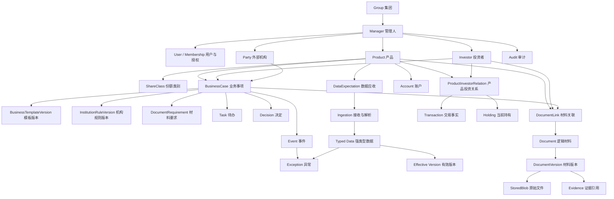
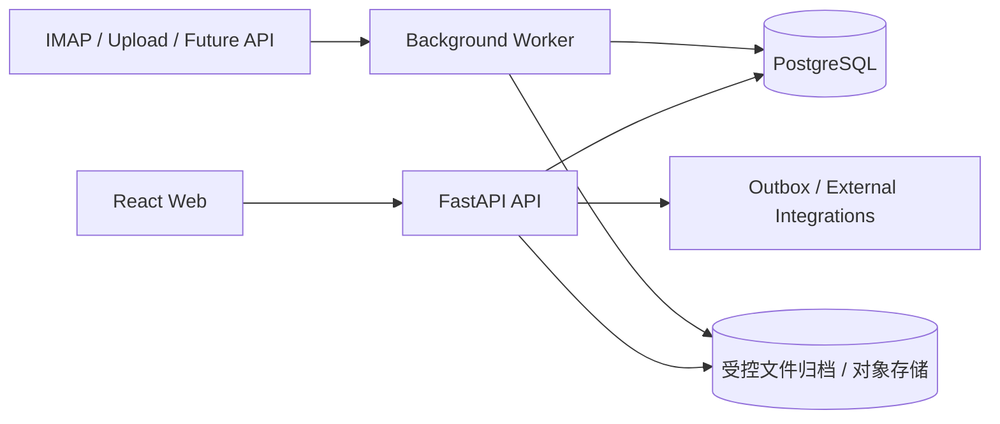

# 基金运营工作台 V2：总体架构（改良版）

> 定位：面向私募证券投资基金管理人的运营控制工作台。
>
> 本文是长期领域方向与当前实现之间的演进蓝图，不是要求一次性建设全部对象的数据库施工图。未经真实业务确认的模型、字段和流程仍属于待验证设计。

---

## 0. 文档结论与状态

### 0.1 一句话架构

> **管理人是数据与权限边界；产品是持续存在的业务主体；Business Case 管理有明确起止的运营事项；Data Operation 管理持续、重复的数据接收与确认；Document 保存材料；Evidence 证明结论；Event 记录业务事实；Task 记录下一步行动；Audit 记录系统操作。**

### 0.2 当前冻结的原则

以下原则可作为现阶段架构基线：

1. 管理人是主要租户和业务数据隔离边界，集团关系不自动带来跨管理人权限。
2. 第一阶段继续只完成 NAV 纵向闭环，不因长期架构扩大当前范围。
3. 有明确开始和结束的运营事项使用 Business Case；每日、每周持续发生的数据接收使用 Data Operation。
4. NAV、交易、持仓、流水等使用强类型业务数据模型，不建设万能 `Data` 表。
5. 原始邮件、附件、候选数据、历史有效版本和审计记录不可被新版本覆盖。
6. 当前状态与形成状态的历史原因分开建模。
7. 模板、机构规则和材料要求必须版本化，历史事项引用当时生效的版本或快照。
8. 继续采用模块化单体，按领域划分代码，不在当前阶段拆分微服务。
9. 新能力以真实案例驱动，采用兼容迁移，不为追求模型整齐而重写已验证链路。

### 0.3 尚不冻结的内容

以下内容需要业务案例或数据样本后再确定：

- 所有 Business Case 类型及字段；
- 完整产品生命周期的审批和状态转换权限；
- 投资者、交易和持仓的最终数据口径；
- 外部机构规则的全部适用维度；
- 材料保管年限及管理员级防篡改方案；
- 集团汇总、规模和收益的计算口径；
- 前端一级模块是否在同一版本全部开放；
- 服务拆分、消息中间件等分布式基础设施。

### 0.4 配套实施文档

- [前端架构与开发规范](基金运营工作台_V2_前端架构与开发规范.md)
- [后端架构与开发规范](基金运营工作台_V2_后端架构与开发规范.md)
- [开发实施手册](基金运营工作台_V2_开发实施手册.md)

---

## 1. 产品定位与系统边界

### 1.1 系统负责什么

系统应能够回答：

1. 今天有什么必须处理，哪些已经超时？
2. 涉及哪只产品、哪个投资者、哪个账户或哪个外部机构？
3. 产品当前处于什么阶段，当前主档内容是什么？
4. 某项业务为什么发生、进行到哪一步、由谁处理？
5. 需要哪些材料、数据、外部操作和确认？
6. 周期性数据今天是否应收、是否收到、是否形成有效版本？
7. 出现了什么异常，影响什么业务，当前由谁处理？
8. 最终以什么回执、材料、数据或决定证明事项已经完成？
9. 当前状态是由哪些业务事实和人工决定形成的？

### 1.2 系统不负责什么

原则上不重复建设：

- 完整 TA 登记与份额核算；
- 完整估值核算引擎；
- 底层支付与银行划款；
- 行情、组合管理和直接交易下单；
- 托管、券商或银行平台已有的专业操作能力；
- 万能 BPM、低代码平台或通用 ERP；
- 在线 Office 编辑器；
- 通用 AI Agent 平台。

系统管理的是：

> 为什么做、什么时候做、去哪做、需要什么、是否完成、拿回什么、哪里异常、谁做了决定、如何证明与追溯。

### 1.3 与外部专业系统的关系

- TA、估值、银行、券商和托管系统继续作为相应专业事实的上游来源。
- 工作台接收结果、保存来源、执行校验、组织事项并形成管理人统一运营视图。
- 外部平台的操作不应伪装成工作台内部已经自动完成；系统必须保存操作入口、执行人、回执和结果状态。

---

## 2. 架构原则

### 2.1 业务语言统一

业务和现有代码统一使用 `Product（产品）` 作为核心实体名称。`Fund` 仅作为英文语义别名，不建立第二套 Fund/Product 实体，也不为改名迁移现有数据库。

### 2.2 强类型优先

- NAV 使用 `NavRecord`、`EffectiveNav` 等明确模型。
- 未来的 TA 交易、持仓、银行流水分别建立本领域模型。
- 共同能力只抽取接收预期、来源、批次、校验、版本和审计，不抽象所有业务字段。

### 2.3 当前状态与历史事实分离

例如：

- `Product` 表达产品当前状态；产品事项和事件解释状态形成过程。
- `Account` 表达当前账户；开户、变更和销户是 Business Case。
- `Holding` 表达当前持有；`Transaction` 表达发生过的交易事实。
- `EffectiveNav` 指向当前有效净值；所有 `NavRecord` 历史版本继续保留。

### 2.4 事实、行动与操作留痕分离

- Event：业务上发生了什么；
- Exception：什么偏离了预期；
- Task：接下来由谁做什么；
- Decision：基于什么依据作出了什么决定；
- Audit：哪个账号对系统做了什么操作。

### 2.5 不采用全量事件溯源

业务主表仍保存当前权威状态，Event 用于时间线、自动化和集成，不要求通过重放所有事件恢复全部业务状态。

### 2.6 渐进式演进

每项结构调整采用：

```text
扩展新结构
  ↓
迁移或回填历史数据
  ↓
短期兼容读写
  ↓
核对数量、权限和结果
  ↓
切换读取来源
  ↓
最后停止旧字段写入
```

不得以一次性重建数据库或大规模重写现有 NAV 链路作为 V2 起点。

---

## 3. 总体领域架构



### 3.1 领域边界

| 领域 | 核心职责 | 当前阶段 |
|---|---|---|
| 组织与权限 | 集团、管理人、成员、角色、动作权限、数据范围 | 已实施，继续完善 |
| 产品 | 产品主档、份额类别、生命周期当前状态 | 已实施基础能力 |
| 数据运营 | 应收、接收、解析、校验、候选、有效版本 | NAV 已实施 |
| 材料与证据 | 原件、业务材料、版本、关联、材料要求、完成证据 | 原件已实施，业务材料待扩展 |
| 业务事项 | 备案、开户、变更、清算等有起止的运营事项 | 选择真实案例后建设 |
| 工作管理 | Event、Exception、Task、Decision | 异常和审计已有基础 |
| 外部机构 | Party、机构业务规则、联系人、操作渠道 | 待真实业务建设 |
| 投资者关系 | Investor、产品投资关系、交易、持有 | 非第一阶段 |

---

## 4. 组织、租户与权限

### 4.1 核心关系

```text
Group
  ├─ Manager A
  │    ├─ Product A1
  │    └─ Product A2
  └─ Manager B
       └─ Product B1
```

- `Manager` 是主要业务数据隔离边界。
- `Group` 只表达关联关系，不自动获得跨管理人数据权限。
- 用户通过 `Membership` 加入一个或多个管理人，并在每个管理人下分别授权。
- 所有关键业务表必须直接包含 `manager_id`，不能只通过多级关联间接判断租户。
- 重要关联使用包含 `manager_id` 的组合外键，阻止跨管理人错误关联。

### 4.2 权限维度

权限至少拆分为：

```text
主体：用户 / 角色
动作：查看 / 创建 / 修改 / 确认 / 下载 / 配置 / 授权
范围：管理人 / 产品 / 业务事项 / 敏感数据类型
条件：当前状态、是否本人提交、是否需要复核
```

### 4.3 投资者敏感信息

身份信息、联系方式、银行卡、风险测评、签约文件等必须独立控制查看与下载权限。当前“管理员拥有本管理人全部页面和操作权限”的规则可以继续适用于第一阶段；引入投资者模块前，必须重新确认管理员是否自动获得投资者敏感信息权限。

### 4.4 审计要求

- 共享角色不能代替实际操作账号。
- 权限授予、撤销、跨管理人访问和敏感材料下载必须留痕。
- Audit 记录行为，不直接充当业务审批或业务决定。

---

## 5. Product：产品及生命周期

### 5.1 产品身份

`Product` 从筹备阶段进入系统，使用系统生成且永不改变的 `product_id` 作为身份。

筹备阶段可能尚无正式备案编码，因此应区分：

- `internal_code`：系统内部唯一编号，可从创建时生成；
- `official_code`：外部正式编码，可为空，取得后补充；
- `proposed_name`：拟定名称；
- `official_name`：正式名称，可为空。

不得为满足非空字段而伪造正式备案编码。

### 5.2 稳定生命周期阶段

建议将产品主生命周期控制在少量、互斥且稳定的状态：

```text
PREPARING 筹备中
    ↓
FUNDRAISING 募集中
    ↓
ESTABLISHED_PENDING_FILING 已成立待备案
    ↓
ACTIVE 运作中
    ↓
LIQUIDATING 清算中
    ↓
LIQUIDATED 已清算
    ↓
ARCHIVED 已归档
```

筹备或募集终止可进入 `CANCELLED 已终止筹备`，不得删除已经形成的材料、事件和审计。

### 5.3 不属于生命周期阶段的事项

以下内容应作为 Business Case、Event 或独立状态维度，不放入单一生命周期枚举：

- 产品申报；
- 合同设计；
- 成立确认；
- 备案申请和备案完成；
- 重大事项变更；
- 开户、变更、销户；
- 暂停申购或赎回；
- 信息披露。

同一产品在 `ACTIVE` 阶段可以多次发生重大事项变更，因此“重大事项变更”不是产品生命周期阶段。

### 5.4 当前状态与历史

- `Product.lifecycle_stage` 保存当前阶段。
- 每次阶段改变同时写入 `ProductLifecycleEvent` 和 Audit。
- 成立日期、备案日期、清算完成日期等业务事实保留为独立日期字段或事件，不用一个通用 `lifecycle_date` 表达所有含义。
- 恢复运作属于受控状态转换，必须记录原因和决定；数据应收规则不得自动恢复。

### 5.5 与现有模型的兼容

- 当前 `active` 映射为 `ACTIVE`；
- `liquidating`、`liquidated`、`archived` 直接映射相应阶段；
- 当前 `ProductFiling` 暂不删除；建设首个 Business Case 后，再将其迁移为筹备产品加备案事项；
- 迁移前继续保留旧 API 和既有产品 ID，不进行无业务价值的主键替换。

---

## 6. Business Case：有起止的业务事项

### 6.1 定义

`BusinessCase` 表示一次真实发生、需要推进并形成结论的运营事项，例如：

- 产品备案；
- 证券或期货账户开立、变更、注销；
- 管理人名称变更；
- 投资者申购或赎回申请；
- 季度信息披露；
- 产品清算。

### 6.2 不应建成 Business Case 的内容

- 每日 NAV 应收；
- 每天自动同步邮箱；
- 每条解析任务；
- 每次页面点击；
- 单纯的数据版本；
- 没有推进和完成语义的静态产品属性。

这些内容分别属于 Data Operation、后台 Job、Data Version 或 Audit。

### 6.3 公共骨架

```text
BusinessCase
├─ id
├─ managerId
├─ businessType
├─ title
├─ source
├─ status
├─ priority
├─ templateVersionId（可选）
├─ initiatedAt
├─ dueAt（可选）
├─ completedAt（可选）
├─ ownerId（可选）
├─ resultSummary（可选）
└─ revision
```

### 6.4 事项主体与参与方

一个事项可能涉及多个产品、投资者、账户或机构，因此不将事项限制为单个 `productId` 和单个 `investorId`。

逻辑上使用 `CaseSubject` / `CaseParticipant`，物理实现优先采用带真实外键的关联表：

- `BusinessCaseProduct`；
- `BusinessCaseInvestor`；
- `BusinessCaseParty`；
- `BusinessCaseAccount`。

每条关联记录角色，例如主要产品、相关产品、申请人、办理机构、复核机构。这样既支持多主体事项，也能保持数据库引用完整性。

### 6.5 通用骨架与业务扩展

Business Case 只保存所有事项真正共有的字段。业务专属信息采用以下方式之一：

1. 高频、高风险、需要查询统计的字段进入类型化扩展表，例如 `AccountOpeningCase`；
2. 低频辅助字段可保存在经过版本化 JSON Schema 校验的扩展数据中；
3. 金额、账户、产品、投资者、状态决定等核心数据不得只保存在无约束 JSON 中。

不得不断给 BusinessCase 主表增加大量可空字段，也不得把它做成万能表单容器。

### 6.6 事项状态

公共状态保持简单：

```text
DRAFT 草稿
OPEN 待处理
IN_PROGRESS 处理中
WAITING_EXTERNAL 等待外部
BLOCKED 受阻
COMPLETED 已完成
CANCELLED 已取消
```

每种业务可以定义允许的状态转换和完成条件，但不得随意改变公共状态的语义。

### 6.7 完成条件

事项完成必须同时满足：

- 必要步骤完成；
- 必要材料要求满足或有合规豁免决定；
- 必要数据结果已确认；
- 关键异常已解决或形成接受决定；
- 存在明确结果；
- 已关联可以证明结果的 Evidence；
- 写入完成事件和审计记录。

---

## 7. Business Template 与 Institution Rule

### 7.1 职责边界

- `BusinessTemplate`：某类业务通常如何办理，描述共性。
- `InstitutionRule`：同一业务在某一家具体机构处如何办理，描述差异。
- `BusinessCase`：某次真实办理，保存当时实际采用的规则与结果。

### 7.2 版本化

模板与机构规则均采用不可变版本：

```text
BusinessTemplate
  └─ BusinessTemplateVersion

InstitutionRule
  └─ InstitutionRuleVersion
```

新版本发布后：

- 新事项默认使用新版本；
- 已创建事项仍引用原版本；
- 若在途事项确需升级，必须通过显式操作并记录差异和操作者；
- 对重要完成条件和材料要求，可在事项中保存必要快照。

### 7.3 机构规则适用范围

机构规则至少需要考虑：

- 机构；
- 业务类型；
- 账户或产品类型；
- 平台及菜单路径；
- 提交渠道；
- 材料覆盖或附加要求；
- 办理时间和截止规则；
- 输出或回执；
- 生效、失效日期；
- 信息来源、确认人和确认日期。

联系人不直接嵌入规则文本，优先引用可独立维护且有权限控制的联系信息。

### 7.4 业务分级

- A 类：高频且规则稳定，做完整系统化；
- B 类：低频但重要，做事项、材料要求和处理记录；
- C 类：极低频或特殊业务，先保存知识卡和历史案例。

业务重复出现且规则稳定后，再从 B/C 类升级，不以页面数量作为系统化标准。

---

## 8. Data Operation：持续数据运营

### 8.1 核心原则

持续数据运营只抽象共同管道，不抽象所有业务数据内容：

```text
DataExpectation 应收预期
  ↓
SourceReceipt 来源接收
  ↓
StoredBlob 原件留存
  ↓
IngestionJob 识别与解析
  ↓
Typed Candidate 强类型候选数据
  ↓
ValidationResult 校验结果
  ├─ 通过 → Effective Version 有效版本
  └─ 异常 → Exception → Task / Decision
```

### 8.2 DataExpectation

建议结构：

```text
DataExpectation
├─ managerId
├─ productId
├─ shareClassId（可选）
├─ dataType
├─ sourcePartyId（可选）
├─ sourceChannel
├─ frequency
├─ calendarRule
├─ dueRule
├─ matchingPolicyId
├─ validationPolicyId
├─ effectiveFrom
├─ effectiveTo（可选）
└─ active
```

它表达“应该收到什么”，不代表已经收到，也不直接保存实际 NAV。

一个产品可以同时具有多条应收规则，例如：

- 日频 NAV；
- 周频估值表；
- 月度银行对账单；
- 季度运营报告。

### 8.3 强类型数据模型

当前 NAV 继续使用：

- `NavRecord`：不可变的候选或历史记录；
- `EffectiveNav`：某份额、某估值日当前有效版本的指针；
- `ValidationResult`：校验结论及使用的规则版本；
- `DocumentVersion` / `SourceReceipt`：数据来源。

未来新增：

- `TaTransaction`；
- `InvestorHoldingSnapshot` 或可验证的 Holding 更新；
- `BankStatementEntry`；
- `PositionSnapshot`。

不得使用一个带 `type + payload_json` 的万能 Data 表代替上述模型。

### 8.4 有效版本与修订

- 原始候选只追加，不原地覆盖。
- 有效数据通过独立指针或明确版本关系表达。
- 反账、更正只产生新记录并更新有效指针。
- 生效操作必须记录原因、操作者、依据、旧版本和新版本。
- 同一业务键的并发生效必须依靠数据库唯一约束和事务保证，不只依赖前端按钮状态。

### 8.5 第一阶段 NAV 闭环

第一阶段保持以下链路：

> 应收 → 邮件或上传接收 → 原件留存 → 产品/份额/日期识别 → 解析 → 校验 → 自动确认或人工处理 → 有效版本 → 反账 → 审计。

当前链路尚未通过真实托管样本和真实邮箱连续试运行前，不扩大第一阶段业务范围。

---

## 9. Document：材料、文件与证据

### 9.1 分层模型

```text
StoredBlob
  ↑
DocumentVersion
  ↑
Document
  ← DocumentLink → Product / Investor / BusinessCase / Party / Account
  ← DocumentRequirement
  ← EvidenceLink
```

### 9.2 对象定义

- `StoredBlob`：收到的原始字节、哈希、大小、媒体类型和存储位置；不可变。
- `Document`：业务上“这份材料是什么”的逻辑身份，例如某产品基金合同。
- `DocumentVersion`：某一具体版本，引用一个 StoredBlob；不可变。
- `DocumentType`：材料分类及基本管理属性。
- `DocumentLink`：材料与产品、投资者、事项、机构或账户的关联。
- `DocumentRequirement`：某业务在某条件下应具备什么材料。
- `EvidenceLink`：某个材料版本、数据版本或外部回执证明哪项业务结论。

### 9.3 去重原则

- 相同字节可以在同一管理人范围内复用 StoredBlob。
- “文件内容相同”不等于“业务材料相同”，不得仅凭哈希合并 Document。
- 跨管理人的物理去重不得暴露另一管理人是否持有某文件，也不得形成跨租户业务关联。
- 一个 Document 可被多个业务引用，不为每个 Business Case 复制业务材料。

### 9.4 材料状态

材料要求的履行状态与材料本身状态分开：

```text
Requirement：待准备 / 已满足 / 已豁免 / 不适用
Document：草稿 / 有效 / 已失效 / 已替代 / 已归档
Submission：待提交 / 已提交 / 被退回 / 已接受
```

这样可以避免用一条线性状态同时表达材料准备、外部提交和版本有效性。

### 9.5 Evidence

Evidence 不复制材料，而是说明：

```text
证明对象：BusinessCase / Event / Decision / 数据有效版本
证明内容：完成、批准、到账、备案、提交成功等
证据来源：DocumentVersion / TypedData / ExternalReceipt
确认人和确认时间
```

---

## 10. Event、Exception、Task、Decision 与 Audit

### 10.1 Event

Event 是已经发生的业务事实，例如：

- 收到托管邮件；
- NAV 候选生成；
- 产品备案完成；
- 托管退回材料；
- 赎回款到账；
- 产品进入清算。

Event 创建后不可修改其事实内容；如需纠正，创建更正事件并关联原事件。

### 10.2 Exception

Exception 表示预期与实际之间存在偏差，例如：

- NAV 到期未收到；
- 解析失败；
- 同日净值冲突；
- 材料缺失；
- 托管退回；
- 资金头寸不足；
- 交收失败。

Exception 是有当前状态的业务对象，可经历打开、处理中、已解决、已接受风险、已关闭等状态。相关状态变化形成 Event 和 Audit。

### 10.3 Task

Task 只回答：

> 谁需要在什么时候前完成什么动作。

- 一个 Business Case 可有多个 Task；
- 一个 Exception 可以生成一个或多个 Task；
- Task 完成不等于 Business Case 自动完成；
- Task 不保存完整业务事实，也不代替事项、异常或审批决定。

### 10.4 Decision

Decision 用于记录对业务结果有影响的人工或规则决定，例如：

- 选择哪个 NAV 版本生效；
- 接受超阈值的真实波动；
- 豁免某项材料要求；
- 同意恢复已清算产品；
- 批准事项完成。

Decision 至少记录决定内容、决定人或规则、时间、原因、输入依据和相关 Evidence。

### 10.5 Audit

Audit 记录系统层面的操作，例如登录、创建、编辑、确认、下载、授权和配置变更。Audit 必须记录真实账号、管理人、动作、对象和时间。

```text
Event     = 业务发生了什么
Exception = 什么偏离了预期
Task      = 接下来谁做什么
Decision  = 基于什么作出什么决定
Audit     = 哪个账号对系统做了什么
```

### 10.6 一致性

关键业务更新必须在一个数据库事务中完成：

```text
更新当前状态
+ 写入必要的 Event
+ 写入 Decision（如有）
+ 写入 Audit
+ 写入待发送的 Outbox 消息（如有外部通知）
```

外部邮件、通知和集成调用通过事务 Outbox 异步发送，避免数据库已经成功但外部动作丢失。第一阶段没有外部通知需求时，可暂不启用 Outbox 消费器。

---

## 11. Investor：投资者关系领域

### 11.1 建设时机

Investor 是长期核心领域，但不进入第一阶段。只有在取得真实签约、适当性、认申购、赎回和 TA 确认样本，并确认敏感信息权限后，才建设完整模型。

### 11.2 核心对象

```text
Investor
  ↕
ProductInvestorRelation
  ↕
Product / ShareClass

ProductInvestorRelation
  ├─ Transaction 历史交易事实
  └─ Holding 当前持有状态或快照
```

### 11.3 关系与交易

- `ProductInvestorRelation` 表达投资者与产品/份额类别之间的持续业务关系。
- `Transaction` 表达由外部 TA 确认的认购、申购、赎回、转换或分红事实。
- `Holding` 表达某个业务时点的当前持有，不自行重做 TA 核算。
- 申购或赎回 Business Case 表达申请和处理过程；TA Transaction 表达最终确认结果，两者不能混为一条记录。

### 11.4 数据血缘

每条交易或持有结果应保存：

- 来源机构；
- 来源文件或接口批次；
- 外部业务编号；
- 业务日期和确认日期；
- 币种、份额类别及精确数值；
- 更正或撤销关系；
- 当前有效版本。

---

## 12. Party、Account 与外部机构关系

### 12.1 Party

`Party` 表示管理人以外的业务参与方，包括托管、外包、券商、期货公司、银行、销售机构、审计机构和律所。

机构的法律主体、品牌、平台和联系人应分开表达，避免机构名称变化后污染历史记录。

### 12.2 Account

`Account` 表达产品当前拥有的业务账户，例如：

- 募集户；
- 托管户；
- 证券账户；
- 证券资金账户；
- 期货账户；
- 银行账户。

开户、变更和销户属于 Business Case；Account 保存经确认后的当前状态和外部标识。

账户号码属于敏感数据，应加密或脱敏显示，并单独控制查看和下载权限。

### 12.3 有效期与历史关系

产品与托管人、券商、银行等关系需要生效和失效日期。历史事项必须仍能找到当时的机构和账户，不因当前合作关系改变而丢失。

---

## 13. 工作台与前端信息架构

### 13.1 工作台聚合

工作台优先回答“今天做什么”，而不是展示大量装饰性图表：

- 今日待办；
- 今日应收、已收、未收数据；
- 在途和超时 Business Case；
- 数据异常；
- 材料缺失、待提交和被退回；
- 即将到期或进入关键阶段的产品；
- 风险、监管和重要业务事件；
- 系统自动完成或需要人工复核的事项。

### 13.2 长期一级模块

长期目标采用 7 + 1：

| 模块 | 核心问题 |
|---|---|
| 工作台 | 今天该做什么，哪里有问题？ |
| 产品中心 | 产品当前是什么状态？ |
| 业务中心 | 正在办理什么，进行到哪一步？ |
| 数据中心 | 应该收到什么，实际收到了什么，哪个版本有效？ |
| 材料中心 | 有什么材料，缺什么，哪个版本有效？ |
| 机构中心 | 去哪办理、如何办理、找谁？ |
| 事件与任务 | 发生了什么、哪里异常、下一步做什么？ |
| 系统管理 | 用户、权限、管理人、规则、集成与审计 |

### 13.3 分阶段开放

第一阶段不为尚未建设的领域显示空模块。当前邮件归档、上传与解析可继续作为独立入口；当数据中心和材料中心成熟后，再将它们调整为二级能力。

投资者中心只有在投资者业务成为稳定、高频工作后才升级为一级模块。

### 13.4 详情页时间线

产品、业务事项、投资者关系和账户详情均可聚合相关 Event、Task、Decision、Document 和 Audit，但不同对象仍保留自己的权威数据来源，不能将所有内容复制到一张时间线表。

---

## 14. 技术架构

### 14.1 当前形态：模块化单体



建议继续保留：

- React + TypeScript 前端；
- FastAPI 应用 API；
- SQLAlchemy 与 Alembic；
- PostgreSQL 生产数据库；
- 独立后台 worker；
- 原始文件归档；
- 同一代码库和统一部署版本。

SQLite 只用于本地单进程调试，不作为生产并发和一致性验收依据。

### 14.2 代码模块边界

后端逐步按领域拆分内部模块：

```text
organization
products
data_operations
nav
documents
business_cases
workflow
institutions
investors
audit
integrations
```

模块之间通过应用服务和明确接口协作，避免任意跨模块修改数据库对象。模块化单体不等于把所有逻辑放在一个 `services.py` 中。

### 14.3 暂不拆微服务的原因

- 当前团队和业务规模尚不需要独立部署各领域；
- NAV 有较强事务一致性需求；
- 领域边界仍在通过真实案例验证；
- 微服务会提前引入分布式事务、消息可靠性、部署和监控成本。

只有当某模块出现独立扩缩容、独立发布、隔离故障或团队所有权需求时，再评估拆分。

### 14.4 后台任务

邮件同步、附件解析、缺件检查和外部通知均以幂等后台任务执行：

- 每个任务有稳定去重键；
- 失败可重试且不能重复生成有效业务数据；
- 保存尝试次数、最近错误和下次运行时间；
- 单条材料失败不能阻断整个邮箱批次；
- 人工重放必须留痕。

初期可继续使用数据库任务表；只有在吞吐或隔离需求经过测量后才引入消息队列。

---

## 15. 数据一致性、版本与安全

### 15.1 数据库约束

- 所有核心关联必须有数据库外键或等价约束。
- 租户相关关联包含 `manager_id`，防止跨管理人引用。
- NAV 等业务唯一性由数据库约束保证。
- 并发人工处理使用 `revision` 乐观锁或条件更新。
- 金额、份额和净值使用 Decimal/Numeric，不使用浮点数。

### 15.2 不可变与可更正

不可变并不意味着错误无法修正，而是：

```text
保留原记录
+ 新增更正记录
+ 建立替代关系
+ 更新有效指针
+ 保存决定与审计
```

### 15.3 时间与日期

- 估值日、交易日等业务日期使用明确的本地业务日期。
- 系统事件时间使用带时区时间戳，统一存储并按用户时区显示。
- 收到时间、解析时间、确认时间和业务日期不得混用。

### 15.4 文件安全

- 下载时校验文件哈希；
- 邮箱凭据使用独立密钥加密；
- 上传文件限制大小、类型和解析资源；
- 生产环境增加恶意文件扫描与解析隔离；
- 原件、数据库和密钥分别备份；
- 恢复演练与备份有效性必须纳入上线验收。

### 15.5 幂等与来源标识

- 邮件使用邮箱、文件夹、UIDVALIDITY、UID 标识接收位置，并结合内容哈希去重原件。
- API 和批量导入使用外部业务编号或请求幂等键。
- 同一文件重复上传不得重复生成相同候选记录。
- 去重结果不能跨租户泄露文件存在性。

---

## 16. 非功能要求

以下指标必须在生产试运行前由业务、合规和技术共同确认具体数值：

### 16.1 可用性与恢复

- 服务可用时间窗口；
- 最大可接受数据丢失范围（RPO）；
- 最大可接受恢复时间（RTO）；
- 邮件同步故障允许持续时间；
- 手工兜底流程。

### 16.2 性能与容量

- 管理人数、产品数、份额数；
- 日均邮件和附件数量；
- 单文件和单邮件大小；
- NAV 和审计历史保留量；
- 页面查询响应目标；
- 历史导入和重解析吞吐目标。

### 16.3 可观测性

至少监控：

- 邮箱最后成功同步时间；
- 应收数据缺失数量；
- 解析成功率和失败类型；
- worker 队列积压和最老任务等待时间；
- 文件归档容量；
- 数据库容量、备份和恢复验证；
- 登录失败、权限拒绝和敏感下载；
- 关键业务状态转换失败。

### 16.4 查询与导出

- 所有大列表必须支持服务端分页和条件查询；
- 监管或审计导出必须记录导出人、范围和时间；
- 导出结果要能追溯使用的数据版本和材料版本；
- 不将页面当前显示的有限条数误认为系统只保留这些数据。

---

## 17. 当前实现与目标模型映射

| 当前对象或字段 | 改良版目标 | 处理方式 |
|---|---|---|
| `Group`、`Manager` | 同名核心对象 | 保留 |
| `User`、`Membership` | 用户及管理人授权 | 保留并扩展动作/敏感范围 |
| `Product` | Product 主档 | 保留实体和 ID，渐进补字段 |
| `ProductFiling` | 筹备 Product + Filing BusinessCase | 首个事项模块成熟后迁移 |
| `ShareClass` | ShareClass | 保留 |
| Product 上的应收字段 | `DataExpectation` | 新建规则后回填，短期兼容 |
| `Document` | 当前近似 StoredBlob/来源材料 | 保留原件记录，按需增加逻辑材料层 |
| `ParseJob` | IngestionJob | 保留并补充幂等、重试与监控 |
| `NavRecord` | 强类型 NAV 候选/历史版本 | 保留，不迁入万能 Data |
| `EffectiveNav` | NAV 有效版本指针 | 保留 |
| `ExceptionTask` | Exception + Task | 第一阶段保留；出现普通任务后再拆分 |
| `AuditEvent` | Audit | 保留；另建业务 Event，不能改名冒充 |
| `Mailbox`、`MailReceipt` | Source configuration / receipt | 保留并归入 integrations/data operations |

---

## 18. 分阶段实施路线

### 阶段 0：完成现有 NAV 验收

目标：证明第一条纵向链路可在真实环境持续运行。

- 一家管理人；
- 一个真实只读邮箱；
- 一种 NAV 模板；
- 一种估值模板；
- 覆盖正常、多份额、重复、冲突、迟到、反账和手工上传；
- 抽检原件、候选、有效版本和审计链路；
- 完成内网部署、备份和恢复演练。

### 阶段 1：抽取共同数据运营能力

- 建立 `DataExpectation`；
- 将 Product 上的 NAV 应收设置迁移为 NAV 类型预期；
- 增加规则有效期和来源配置；
- 保持现有 NAV API 和页面可用；
- 增加队列、缺件与解析监控。

### 阶段 2：完善材料层

- 在不改动原始归档的前提下增加 DocumentType、DocumentLink；
- 用真实产品合同或开户材料验证逻辑 Document 和版本；
- 建立材料访问边界；
- 验证同一材料被多个事项引用。

### 阶段 3：验证首个 Business Case

只选择一个真实且有样本的业务，优先考虑产品备案或账户开立：

- 建立公共事项骨架；
- 建立该业务的类型化扩展；
- 建立模板版本、机构规则版本和材料要求；
- 关联 Task、Event、Decision、Evidence；
- 验证完成条件和历史版本不受模板更新影响。

### 阶段 4：拆分工作管理概念

当系统出现非异常型普通待办后：

- 将 Exception 与 Task 分开；
- 保留旧 ExceptionTask ID 或映射关系；
- 增加事项和产品时间线；
- 避免为了概念统一迁移所有历史记录。

### 阶段 5：投资者与 TA 结果

只有取得真实数据和权限结论后建设：

- Investor；
- ProductInvestorRelation；
- 申购、赎回 Business Case；
- TA Transaction；
- Holding；
- 适当性和签约材料；
- 投资者敏感信息权限与脱敏。

---

## 19. 主要风险与控制

| 风险 | 典型表现 | 控制方式 |
|---|---|---|
| 过度抽象 | 万能 Data、万能 BusinessCase、万能 JSON | 强类型领域数据，公共骨架加业务扩展 |
| 过早扩面 | NAV 未验收就建设全部运营流程 | 先完成真实 NAV 闭环，再选一个事项验证 |
| 状态爆炸 | 产品状态混入备案、变更、暂停等事项 | 稳定生命周期 + 独立事项/状态维度 |
| 模板污染历史 | 修改模板后旧事项步骤变化 | 不可变模板版本或事项快照 |
| 材料重复与错绑 | 每项业务复制文件或哈希误合并 | Blob、Document、Version、Link 分层 |
| 事件与审计混淆 | 审计日志被用作业务事实 | Event 与 Audit 分开，同事务写入 |
| 跨租户关联 | 通过错误 ID 关联其他管理人对象 | manager_id + 组合外键 + 服务端授权 |
| 敏感数据扩散 | 管理员或下载权自动覆盖投资者资料 | 投资者敏感权限独立确认和授权 |
| 迁移破坏现有链路 | 一次性重命名或改表导致 NAV 停用 | 扩展、回填、兼容、核对、切换 |
| 前端空心化 | 一次开放 7+1 但多数页面无能力 | 按阶段显示成熟模块 |

---

## 20. 架构决策检查表

新增业务进入开发前，至少回答：

```text
1. 它属于哪个管理人？
2. 核心主体是 Product、Investor、Party、Account 还是它们的关系？
3. 它是有起止的 Business Case，还是持续 Data Operation？
4. 权威业务数据应使用什么强类型模型？
5. 需要哪些材料，材料要求来自哪个版本？
6. 涉及哪家机构，引用哪个 InstitutionRuleVersion？
7. 会产生哪些 Event、Exception、Task 和 Decision？
8. 以什么 Evidence 证明完成或生效？
9. 当前状态和历史事实分别保存在哪里？
10. 唯一性、幂等、并发和租户隔离如何由数据库保证？
11. 哪些敏感信息需要独立查看或下载权限？
12. 如何迁移、回滚并证明没有破坏现有 NAV 链路？
```

如果这些问题没有得到真实案例、样本或业务负责人确认，该能力仍处于调研或原型阶段，不应仅凭概念完整性进入生产开发。

---

## 21. 最终对象清单

对象按成熟度分组，不要求一次性全部建立。

### 21.1 当前核心

- Group
- Manager
- User
- Membership
- Product
- ShareClass
- DataExpectation
- StoredBlob / 当前 Document 原件
- IngestionJob
- NavRecord
- EffectiveNav
- ExceptionTask（阶段性兼容）
- Audit

### 21.2 首个业务事项后引入

- BusinessCase
- 业务类型扩展表
- BusinessTemplate
- BusinessTemplateVersion
- Party
- InstitutionRule
- InstitutionRuleVersion
- DocumentType
- Document
- DocumentVersion
- DocumentLink
- DocumentRequirement
- EvidenceLink
- Event
- Exception
- Task
- Decision

### 21.3 投资者阶段引入

- Investor
- ProductInvestorRelation
- TaTransaction
- Holding / HoldingSnapshot
- InvestorSensitiveProfile

### 21.4 明确不建立的万能对象

- 万能 Data；
- 万能 Workflow；
- 万能 Form；
- 只有 `type + payload_json`、缺少业务约束的通用事实表；
- 与 Product 含义重复的 Fund 实体。

---

## 22. 最终建议

这套架构应同时服务两个目标：

1. **眼前可用**：保持现有 NAV 链路、数据库约束、原件留存、有效版本和并发处理能力；
2. **未来可扩展**：通过 Business Case、DataExpectation、材料证据、机构规则和投资者关系逐步覆盖产品全生命周期。

正确的实施方式不是“先建完所有通用对象，再寻找业务来使用”，而是：

```text
真实业务案例
  ↓
确认主体、规则、材料、数据与完成证据
  ↓
判断进入现有领域还是新增类型化能力
  ↓
以最小增量实现
  ↓
试运行并沉淀为模板或机构规则
  ↓
重复出现后再提高自动化程度
```

因此，本版本冻结的是领域边界、数据治理原则和渐进路线，不冻结未经真实业务验证的所有字段、页面与流程。
