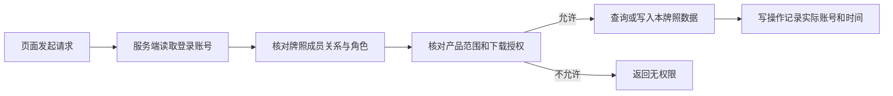
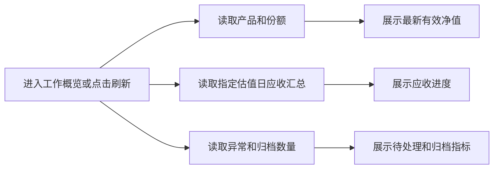
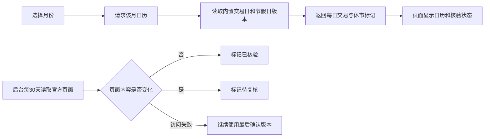
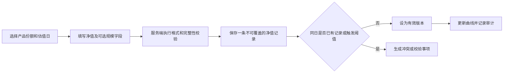
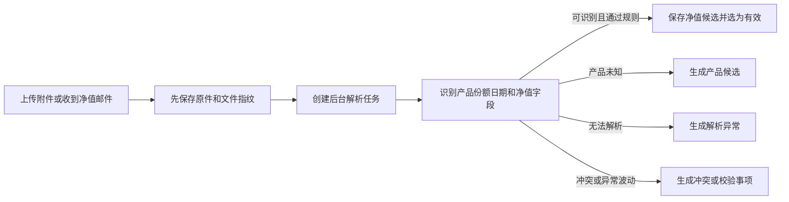
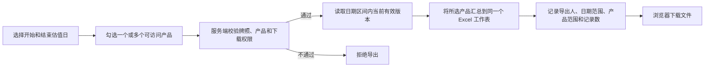
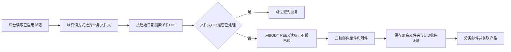
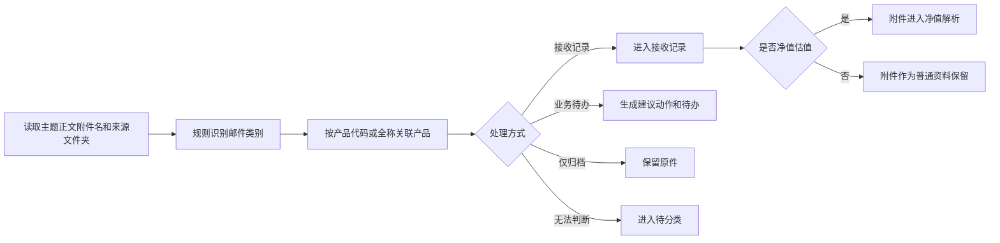

# 当前已实施功能说明

更新日期：2026-09-15
整理口径：以当前前端页面、后端接口、数据库模型和后台任务的实际代码为准。“已实施”表示本地项目已有完整入口和持久化处理，不代表已经完成真实生产环境连续运行验收。

## 一、全局能力

### 1. 登录、会话与牌照切换

- 使用邮箱和密码登录，没有内置默认账号或默认密码。
- 密码使用 Argon2 哈希保存；登录成功后使用服务端会话 Cookie。
- 一个账号可以关联多个管理人牌照，并在左侧切换当前工作空间。
- 每次查询和写入均重新校验当前账号对管理人、产品和资料的权限。
- 支持退出登录和修改密码；修改密码后已有会话失效并要求重新登录。


### 2. 权限边界

- 管理员可以管理本牌照配置、成员和权限，并拥有本牌照页面及操作权限。
- 运营人员和运营负责人可以执行日常业务写入。
- 管理层、集团查看和合规角色可以按授权读取。
- 基金经理、交易员和财务按产品授权读取。
- 原件下载使用独立授权；能查看页面不代表能下载原件。
- 跨牌照写入、跨牌照关联和越权下载均由服务端拒绝。



## 二、工作概览

### 已实施功能点

- 显示当前可查看的在管产品数、已有有效净值的份额数、待处理事项数和归档原件数。
- 选择估值日后显示应收、已收到材料、已确认有效净值的进度。
- 显示最多六个产品份额的最新有效净值，并可跳转到净值详情。
- 显示最多四个待处理异常，并可直接打开异常详情。
- 提供上传材料快捷入口。
- 右侧运营日历按月显示交易日、休市、中国法定节假日和调休上班日。
- 日历当前内置上交所 2025—2026 年安排；后台每 30 天核验官方页面是否变化，发现变化只提示复核，不直接改动业务日期。
- 产品开放日功能当前未启用。

### 概览数据加载流程



### 运营日历查看流程



## 三、产品台账

### 已实施功能点

- 按名称或产品代码搜索产品。
- 默认隐藏已清算、已归档产品，可切换显示。
- 显示产品代码、生命周期、份额类别、净值发送频率、接收截止时间、策略和币种。
- 人工创建产品并一次建立多个份额类别。
- 登记简化的产品备案事项，备案结束后转入正式产品台账。
- 将附件解析得到的产品候选经人工核对后加入台账，并重新解析原件。
- 为既有产品新增份额类别。
- 配置产品是否纳入净值应收、日频或周频、周频估值星期和截止时间。
- 变更产品状态为运作中、清算中、已清算或已归档；已清算必须上传依据材料。
- 从产品行跳转净值详情，或按产品筛选资料中心。

### 人工创建产品流程


### 产品备案转台账流程


当前只记录拟设信息和完成转换，不包含完整备案节点、外部报送或审批。

### 解析候选确认流程


### 新增份额流程


### 应收设置流程


日频截止固定为 15:00；周频遇休市时使用此前交易日。停用产品应收不会删除历史待办和原件。

### 生命周期变更流程


## 四、净值与估值

### 已实施功能点

- 按产品和份额查看最新单位净值、资产净值、仓位和现金。
- 仓位和现金只显示附件明确披露的字段，缺失不推算。
- 查看单位净值走势、净值变化和回撤，可切换全部、近三个月和近一个月。
- 查看最近 1,000 条净值版本，包括估值日期、材料收到时间、来源、操作人、校验结果和有效状态。
- 人工补录单位净值、累计净值、资产净值和总份额。
- 上传或邮件附件可由后台解析为净值候选。
- 同一份额同一估值日出现多条数据时保留所有版本，生成冲突事项，由运营选择有效版本。
- 支持将有效版本标记为反账后版本并填写原因。
- 可下载对应原件，需同时具备原件下载和完整产品范围权限。
- 可按单日或日期区间勾选任意多个可访问产品，并将所选产品净值汇总到同一个 Excel 工作表。
- 净值导出只取当前有效版本，标记反账状态，并包含净值记录编号、原件编号和有效版本号。服务端同时校验产品范围和下载权限，并记录导出留痕。

### 人工补录流程



### 附件自动解析流程



### 按日期导出净值流程



### 冲突、校验与反账处理流程


当前净值变化指标不等于投资者收益；完整持仓、分红和收益口径仍需真实托管样本适配。

## 五、邮件中心

### 已实施功能点

- 显示多个邮箱的启用状态、同步时间和错误。
- 邮件按待处理、接收记录、待分类、已完成四个视图展示。
- 按主题、发件人或关联产品搜索。
- 显示邮件主题、短摘要、发件人、分类、附件数量、置信度、关联产品、业务日期、来源邮箱和文件夹。
- 点击邮件标题区域或“展开邮件”，可查看完整主题、发件人、收件人、抄送、邮件时间、正文、来源邮箱和全部附件。
- 邮件 HTML 正文经净化后在隔离区域内按原排版展示，保留常用表格、颜色、字号和段落样式；脚本、表单、外部图片和外部样式被阻止，并可切换到完整纯文本正文。
- 可查看原始 `.eml` 文件，需原件下载权限。
- 自动分类净值估值、期货结算、对账数据、风险投监、合同用印、申赎投资者、安全提醒、普通业务待办、完成通知和营销信息。
- 申赎投资者类邮件及附件使用独立投资者查看权限。
- 自动判断处理方式：接收记录、业务待办、仅归档或待分类。
- 人工修正邮件分类和处理方式；改为净值估值后，受支持附件才进入净值解析。
- 完成邮件待办时填写实际处理结果并留痕。

### 多邮箱只读同步流程



同步层不提供发送、删除、移动、复制、追加、改标记和修改文件夹接口。每轮每个邮箱最多处理 100 封，后续轮次继续同步。相同原件按 SHA-256 复用归档，但每个邮箱和文件夹的接收来源仍分别记录。

### 邮件自动分类流程



### 邮件完整展开流程


### 人工确认分类流程


### 邮件待办完成流程


平台当前只记录邮件提示和处理结论，不代替托管平台执行申购、赎回、补发或其他外部操作。

## 六、资料中心

### 已实施功能点

- 汇总除邮件正文原件外的上传文件和邮件附件。
- 显示归档资料数、待整理数、已关联主体数和处理中数量。
- 按全部、待整理、已关联、处理中切换。
- 服务端按产品、投资者、资料类别、来源和敏感级别筛选，并按文件名、整理标题、备注、邮件元数据、产品或投资者搜索。
- 显示标题、原文件名、文件大小、SHA-256 摘要、类别、关联产品、关联投资者、敏感标识、业务日期或期间、来源、收到时间和处理状态。
- 手工上传单份资料，当前上限 25 MiB，可先不关联主体；也可在上传时直接选择投资者和产品。
- 上传时选择投资者会在同一事务中标记为投资者敏感资料、建立关联并停止净值解析，避免整理前暴露为普通资料。
- 整理资料时可修改展示标题、选择类别、敏感级别、填写业务日期或期间、备注，并关联零个、一个或多个产品和投资者。
- 整理结果与原件分开保存；修改整理信息不会重命名、移动或覆盖原件。
- 净值与估值资料可以重新解析；解析发现未知产品时可进入产品候选确认。
- 下载时校验牌照权限、下载权限和文件 SHA-256。
- 资料列表由服务端分页，每页 50 条；总数与待整理、已关联、处理中统计不受原有 300 条上限影响。
- 批量导入和批量整理尚未实施。

### 投资者视图

- “资料”和“投资者”在同一资料中心入口内切换，侧栏不再设置独立投资者页面。
- 可按名称搜索个人、机构、产品型、资管计划、管理人跟投及其他类型，并保存展示名称、核对状态、来源和说明。
- 一个投资者可关联多个产品；页面显示关联产品和资料数量。
- 投资者记录按管理人牌照隔离，只有本牌照的管理员、运营、运营负责人及合规角色可以读取；写入限管理员、运营和运营负责人。
- 已支持加密保存证件号码和银行账号，接口与页面只返回掩码；联系方式、适当性字段和多银行账户可结构化登记。
- 已增加不可覆盖的份额变动流水和托管持仓快照。申请、受理和通知只留痕，正式确认经人工核对后才计入持仓汇总；平台不向托管提交、撤销或审批申赎。
- 份额记录可以关联原始邮件和单个确认附件；从邮件整理时不会改变邮件的已读、移动、删除或发送状态。
- “待整理”目录只用于确认主体类型和关系设计，没有自动写成未经核对的正式投资者记录。

### 投资者建档和跨产品关联流程


### 投资者资料归档流程

```mermaid
flowchart LR
    A[上传文件] --> B{是否选择投资者}
    B -->|否| C[按普通资料进入待整理]
    B -->|是| D[立即标记投资者敏感资料]
    D --> E[关联投资者和可选产品]
    E --> F[跳过净值解析并等待人工确认类别]
    F --> G[有投资者权限的人员整理和下载]
```

投资者类邮件及其附件也使用投资者权限；无权限人员不能从邮件中心、资料列表或下载接口绕过限制。

### 邮件份额信息整理流程

```mermaid
flowchart LR
    A[申赎或投资者邮件] --> B[选择投资者产品及确认附件]
    B --> C{材料阶段}
    C -->|通知申请或受理| D[保存流水并等待处理或仅归档]
    C -->|正式确认| E[建立待确认份额事件]
    E --> F[人工核对份额变动和业务编号]
    F --> G[确认后计入持仓汇总]
    B --> H[原始邮件和附件保持不变并建立来源关联]
```

托管持仓表单独保存为某日快照，与已确认流水的计算值比较。存在差异时页面提示，不自动覆盖流水。

### 单份上传流程

```mermaid
flowchart LR
    A[选择文件和可选产品投资者] --> B[服务端校验权限和25MiB上限]
    B --> C[计算SHA-256并保存原件]
    C --> D[保存来源收到时间和上传账号]
    D --> E{是否关联投资者}
    E -->|是| F[标记敏感并关联主体]
    F --> G[跳过净值解析并等待整理]
    E -->|否| H[创建解析任务]
    H --> I{是否可识别净值}
    I -->|是| J[进入净值处理链路]
    I -->|否| K[保留为待整理资料]
```

### 资料整理流程

```mermaid
flowchart LR
    A[打开待整理资料] --> B[核对标题类别日期期间和备注]
    B --> C[选择一个或多个产品和投资者并确认敏感级别]
    C --> D[确认整理结果]
    D --> E[保存独立整理记录和主体关联]
    E --> F[原件及来源信息保持不变]
    F --> G[记录操作人时间和前后值]
```

### 原件下载流程

```mermaid
flowchart LR
    A[用户点击下载] --> B[服务端校验牌照和下载权限]
    B --> C[定位归档文件]
    C --> D[重新计算SHA-256]
    D -->|一致| E[返回原件]
    D -->|不一致| F[拒绝下载并报告归档异常]
```

### 重新解析流程

```mermaid
flowchart LR
    A[点击重新解析] --> B[校验资料属于净值估值类别]
    B --> C[解析任务重新排队]
    C --> D[后台读取原件]
    D --> E[保存新的解析结果或异常]
    E --> F[不覆盖原件和既有净值版本]
```

## 七、异常中心

### 已实施功能点

- 统一展示净值缺件、解析失败、产品未知、校验异常、同日冲突和邮箱同步异常。
- 按待处理和已解决查看，保留解决结论。
- 当前牌照成员共享异常队列，可以直接处理；提交时记录实际账号。
- 可下载异常对应原件。
- 对解析和校验异常，可人工补齐一至一百条净值并确认材料已完整处理。
- 对解析失败可重新解析。
- 对冲突和校验事项可选择有效版本、填写原因并标记反账。
- 对缺件事项可记录已在托管平台补发、关联已经收到的附件或上传补充材料。
- 邮箱级故障在同步恢复后自动解决，不允许手工忽略。

### 自动应收与缺件生成流程

```mermaid
flowchart LR
    A[后台按交易日历运行] --> B[生成前一交易日各份额应收]
    B --> C[匹配同份额同估值日净值记录]
    C -->|15点前收到| D[记录按时收到]
    C -->|15点后收到| E[生成迟到记录后解除缺件]
    C -->|仍未收到| F[生成缺件事项]
    F --> G{到下一交易日跟进时间}
    G -->|是| H[升级为核查托管补发]
    G -->|否| I[继续等待]
```

### 人工检查应收流程

```mermaid
flowchart LR
    A[选择一个交易日估值日] --> B[按当前产品应收配置计算]
    B --> C[为应收份额建立或复用应收记录]
    C --> D[匹配已归档净值]
    D --> E[页面刷新应收和异常结果]
```

### 托管补发留痕流程

```mermaid
flowchart LR
    A[运营在托管平台执行补发] --> B[在缺件事项填写说明]
    B --> C[保存操作人时间和补发说明]
    C --> D[缺件事项继续保持打开]
    D --> E[后续材料到达后自动或人工匹配]
```

平台不会代替运营发送邮件或操作托管平台。

### 人工关联已收到材料流程

```mermaid
flowchart LR
    A[选择已归档的净值附件] --> B[填写产品份额估值日对应说明]
    B --> C[服务端校验同牌照和产品关系]
    C --> D[应收记录标记材料已收到]
    D --> E[解除缺件事项]
    E --> F[解析和校验异常仍单独保留]
```

## 八、业务留痕

### 已实施功能点

- 按时间倒序显示最近 500 条审计记录。
- 显示实际操作账号、动作和时间。
- 展开后可查看对象标识和结构化依据。
- 产品建档、投资者建档、净值确认、反账、资料整理、敏感资料关联、资料下载、邮箱配置、邮件分类、邮件待办、应收处理和权限调整等写操作均进入审计。
- 系统后台自动动作以系统身份记录。

### 留痕查询流程

```mermaid
flowchart LR
    A[业务操作或后台任务完成] --> B[同一事务写入审计事件]
    B --> C[保存账号动作对象时间和详情]
    C --> D[业务留痕页面读取最近500条]
    D --> E[用户展开查看依据]
```

审计记录是操作证据，不自动等同于已经满足具体监管保存期限或合规要求。

## 九、组织与权限

### 已实施功能点

- 管理员查看本牌照成员、角色、下载权限和产品授权。
- 创建新账号并设置初始密码、角色、下载权限及产品范围。
- 调整既有成员授权；系统并发保护本牌照至少保留一名管理员。
- 配置净值变化提醒阈值；单位净值为正等强制规则始终有效。
- 启用或停用净值自动应收，配置检查起始日和下一交易日跟进时间。
- 登记、编辑、测试、启用或停用多个 IMAP 邮箱。
- 邮箱授权码加密保存且不回显；更新时留空表示不更换。
- 邮箱可选择仅收件箱或全部业务文件夹；全部业务文件夹自动排除已发送、草稿、垃圾和已删除目录。

### 成员创建与授权调整流程

```mermaid
flowchart LR
    A[管理员填写账号和授权] --> B[校验角色产品和密码]
    B --> C[创建账号或锁定既有成员关系]
    C --> D[保存牌照角色]
    D --> E[保存产品范围和下载权限]
    E --> F[检查至少保留一名管理员]
    F --> G[记录权限调整审计]
```

已有账号关联新牌照和忘记密码重置目前由部署工具处理，网页不会覆盖既有账号密码。

### 净值校验阈值配置流程

```mermaid
flowchart LR
    A[管理员填写变化比率阈值] --> B[保存本牌照规则]
    B --> C[后续净值与前一有效值比较]
    C -->|超过阈值| D[生成可人工核对的校验事项]
    C -->|未超过| E[按正常规则处理]
```

### 自动应收策略配置流程

```mermaid
flowchart LR
    A[管理员设置启用起始日和跟进时间] --> B[确认适用交易日历]
    B --> C[保存本牌照应收策略]
    C --> D[后台每分钟检查未处理日期]
    D --> E[按产品和份额生成应收及异常]
```

首次启用不追补起始日前缺件；停用只暂停生成新检查，历史记录继续保留。

### 邮箱登记与测试流程

```mermaid
flowchart LR
    A[管理员填写服务器账号和授权码] --> B[使用SSL或STARTTLS测试连接]
    B -->|失败| C[拒绝保存新授权码并提示配置问题]
    B -->|成功| D[加密授权码]
    D --> E[保存邮箱和同步范围]
    E --> F{是否启用}
    F -->|是| G[后台开始只读同步]
    F -->|否| H[保留配置和历史归档]
    G --> I[记录配置与测试审计]
```

## 十、当前明确未实施或未完成验收的内容

- 资料中心的账户、报送批次等独立主体。
- 批量导入、批量整理、附件正文全文搜索和 OCR。
- 资料版本组、当前版本选择、到期和缺失材料检查、完整材料导出。
- 完整投资者身份字段、账户、签约、份额余额、申购赎回核算或托管平台提交。
- 产品开放日提示。
- 完整持仓、交易、收益和分红核算。
- 自动发送邮件、操作托管平台或修改原始邮箱状态。
- 生产环境真实邮箱长期联调、正式内网部署、备份恢复和灾难演练的最终验收。
