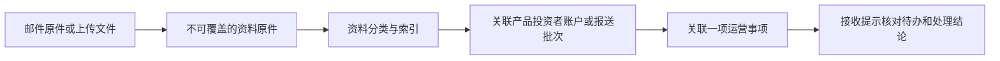
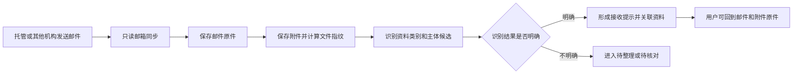
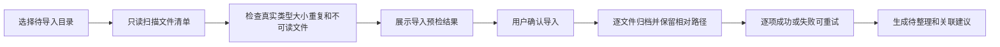
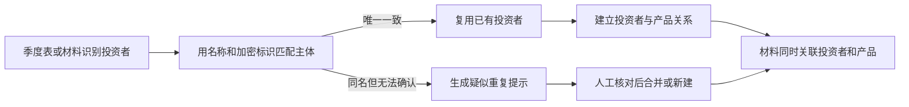
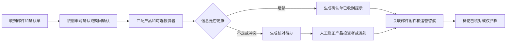
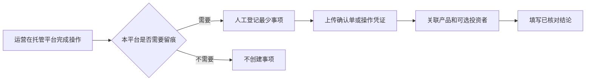
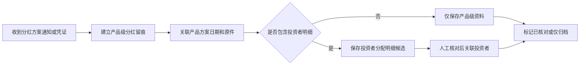
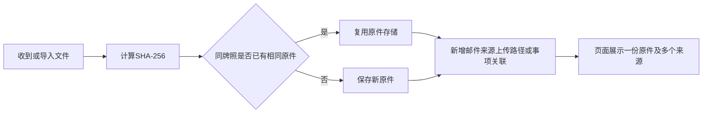
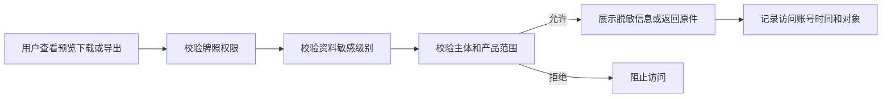

# 资料中心功能开发预览

更新日期：2026-09-11
目标：把分散的邮件、附件和历史文件整理成可查证的资料关系，减少人工翻找；平台保留运营证据和处理结论，不代替托管平台提交申购、赎回、分红或其他交易操作。

## 一、产品定位

资料中心应当成为全平台的“证据库”，并在证据库之上提供轻量运营留痕。

这里需要严格区分：

- **原件**：邮件、附件、上传文件，保存文件指纹、来源和收到时间。
- **整理结果**：标题、资料类别、业务日期、期间、说明和敏感级别，可以修正并留痕。
- **资料主体**：管理人、产品、投资者、账户和报送批次。
- **运营事项**：一件需要说明发生了什么的事情，例如收到赎回确认单；它不是托管平台上的执行指令。
- **处理结论**：已核对、需要补充、匹配错误、仅归档或确认单已收到。

## 二、现有能力如何保留

本轮不重建原件归档和净值链路：

- 继续使用现有 `Document` 保存原件、SHA-256、来源、父邮件和附件关系。
- 继续使用 `DocumentMaterial` 保存人工整理信息。
- 继续保留邮件只读同步、上传、下载校验、净值解析和审计。
- 现有“资料—产品”关系继续可用，并迁移或扩展为通用主体关系。
- 申购、赎回、分红材料不会写入净值记录，也不会自动形成金额或份额核算结论。

已完成的首批改造：

- 已建立轻量投资者主体和投资者—产品多对多关系。
- 已增加投资者主体、适当性、风险测评、合格材料有效期等结构化字段，并可分别关联基础信息和适当性来源原件。
- 证件号码和银行账号使用本机密钥加密保存，接口与页面只显示掩码；银行账户支持一名投资者多账户及账户—产品关系，停用时保留历史记录。
- 资料可关联多个产品和多个投资者，并保存独立敏感级别。
- 资料已增加具体类型，可区分投资者信息表、风险测评、身份证明、税收声明、合同、认申购和赎回等材料；适当性清单优先按资料类型归纳。
- 上传时可直接关联投资者；投资者邮件、附件、资料列表和下载接口统一执行投资者权限。
- 资料中心内已提供投资者视图，可搜索、建档、编辑并查看关联产品和关联资料数量。

仍需改造的部分：

- 资料可作为银行账户的来源原件；通用的资料—账户多对多关系和报送批次尚未建立。
- 现有邮件分类把“申赎/投资者”放在一个类别，无法区分申购确认、赎回确认、失败或分红通知。
- 现有邮件待办以单封邮件为中心；实际上一件事项可能由通知、补充邮件和确认单共同构成。
- 服务端分页、主体筛选和结构化搜索已完成；附件正文全文检索和资料期间筛选仍待实现。

## 三、建议的数据对象

### 1. 投资者

最小字段：

| 字段 | 说明 |
|---|---|
| 投资者类型 | 个人、机构、私募基金产品、资管计划、管理人跟投等 |
| 展示名称 | 页面和检索使用 |
| 证件或登记标识 | 已实现加密保存，页面和接口脱敏 |
| 状态 | 有效、历史、待核对 |
| 来源 | 人工建立、季度表导入或材料识别 |

投资者与产品必须是多对多关系。现有样本已经确认自然人跨产品、管理人跟投跨产品，以及一只私募基金作为其他产品投资者的情况。

### 2. 投资者与产品关系

现已建立投资者与产品的多对多关系，用于查找和资料归集。关系起止日期、关系依据和历史变化仍待扩展；当前不计算持有份额或收益。

### 3. 通用资料关联

一份资料可以同时关联多个对象：

| 关联对象 | 示例 |
|---|---|
| 管理人 | 管理人登记、制度、通用风险通知 |
| 产品 | 合同、备案材料、估值表、清算材料 |
| 投资者 | 身份证明、风险测评、认申购材料、双录 |
| 账户 | 证券账户、期货账户、月度结算单 |
| 报送批次 | 一只产品某季度的运行表和投资者信息表 |
| 运营事项 | 一次申购确认、赎回确认、分红通知或材料补充 |

关系记录应保存“自动建议或人工确认”“置信度”“依据”和“确认账号”。不要把这些关系塞进文件的自由文本备注。

### 4. 轻量运营事项

建议名称使用“运营留痕”，避免让用户误以为平台可以操作托管交易。

最小字段：

| 字段 | 说明 |
|---|---|
| 事项类型 | 申购确认、赎回确认、分红通知、失败通知、材料补充、其他 |
| 产品 | 必填或待核对 |
| 投资者 | 可选；邮件未给出时不猜测 |
| 托管机构 | 用于决定跟踪方式 |
| 业务日期 | 来自确认单或人工填写，不能用收件时间代替 |
| 状态 | 待核对、确认单已收到、已核对、失败、仅归档 |
| 外部流水号 | 托管确认单提供时保存 |
| 证据 | 可关联多封邮件和多个附件 |
| 结论 | 实际处理人、时间和说明 |

一项运营事项可以关联多封邮件；一封邮件也可以包含多个产品或多项确认，必要时拆分为多个事项。

### 5. 原件复用与版本

- 同牌照内容完全相同的文件只存一份二进制原件，但每次邮件接收、上传路径和业务关联分别保留。
- 同名但内容不同必须保存为不同原件。
- 内容发生变化时建立新原件；只有人工确认后才组成版本组。
- 不同日期的净值、月度结算单和季度报告属于连续期资料，不作为互相覆盖的版本。

## 四、前端页面预览

### 1. 资料中心总览

建议保留现有入口，并增加以下视图：

- 全部资料、待整理、待核对、仅归档、处理中。
- 按资料一级类别、二级类别、产品、投资者、账户、报告期、来源和敏感级别筛选。
- 服务端分页和结构化字段搜索已完成；附件正文全文检索仍待实现。
- 列表只展示必要摘要；详情抽屉展示全部关联、原件来源和处理历史。
- 批量导入和批量整理入口。

建议的两层类别：

| 一级类别 | 二级示例 |
|---|---|
| 净值与估值 | 净值表、估值表、估值对账 |
| 投资者准入与适当性 | 身份证明、合格投资者证明、风险测评、税收声明、双录 |
| 合同及认申购 | 产品合同、认申购单、申购确认、赎回确认 |
| 产品备案与变更 | 备案函、重大变更、清算材料 |
| 定期报告 | 季度运行表、投资者信息表、其他报告 |
| 账户与结算 | 证券账户、期货账户、月度结算单 |
| 风险合规 | 投资监督、风险提示、合规通知 |
| 运营凭证 | 托管操作截图、回执、处理说明 |

### 2. 资料详情

详情页或侧边抽屉展示：

- 原文件名、文件指纹、大小、真实文件类型、来源和收到时间。
- 来源邮件及同一邮件的其他附件。
- 整理标题、类别、业务日期、资料期间和备注。
- 关联的管理人、产品、投资者、账户、报送批次及运营事项。
- 自动建议与人工确认的区别。
- 整理历史、版本关系、下载记录和原件校验状态。

### 3. 投资者资料视图

- 搜索投资者名称，查看其投资或曾投资的多个产品。
- 汇总身份、适当性、合同、认申购、双录和确认单等资料。
- 按产品查看同一投资者的材料。
- 对同名投资者在证件标识无法确认时保持“疑似重复”，由人工合并。
- 产品型投资者和管理人跟投保留正确主体类型。

### 4. 报送批次和账户序列

- 同一产品同一季度的运行表、投资者信息表、说明和附件组成一个报送批次。
- 同一账户不同月份的结算单组成时间序列。
- 首期只提取产品代码、账户、报告期、文件角色和提交状态，不直接将持仓或成交写入净值。

### 5. 运营留痕视图

- 按待核对、确认单已收到、已核对、失败、仅归档查看。
- 每项显示产品、投资者、托管机构、业务日期和证据数量。
- 允许关联已有资料、上传确认单、修正匹配、填写核对结论。
- 不提供“提交申购”“提交赎回”“执行分红”按钮。

## 五、计划中的数据流

### 1. 邮件附件进入资料中心

### 2. 历史文件批量导入

批量导入不移动、重命名或改写源目录。单个大文件失败不能回滚已经成功的文件。

### 3. 投资者跨产品关联

### 4. 收到申购或赎回确认邮件

平台只记录确认单和核对结论。申购赎回的提交、撤销、金额核算和份额登记仍在托管平台完成。

### 5. 托管不发送邮件时的处理

系统不能因“没有收到邮件”推断发生了申购或赎回。只有运营事先登记了待收确认单，系统才可以提醒材料尚未归档。

### 6. 分红资料处理

首期不计算分红金额、税费或收益率；只有原件明确提供的字段才允许保存。

### 7. 重复材料处理

### 8. 敏感资料访问

个人身份证明、联系方式、资产证明、风险测评和双录需要独立敏感权限；普通产品查看权不能自动获得这些原件。

## 六、不同托管机构的跟踪方式

按产品或托管机构配置，不强制所有机构采用同一流程：

| 方式 | 适用情况 | 平台行为 |
|---|---|---|
| 邮件确认 | 托管会发送通知或确认单 | 自动归档、分类、关联并提示 |
| 人工留痕 | 托管不发送邮件，但运营需要保留证据 | 人工登记最少事项并上传确认单或凭证 |
| 仅资料归档 | 不需要事项状态 | 文件进入资料中心，不生成待办 |
| 不跟踪 | 没有邮件也无本平台留痕要求 | 不创建事项，不对缺失邮件作推断 |

跟踪方式可以按实际使用逐步启用，不能把“未收到邮件”统一当作业务异常。

## 七、开发顺序

### 第 1 步：轻量投资者主体和敏感权限（已完成首批）

- 已新增投资者主体及跨产品关系；账户和报送批次仍待建设。
- 已支持一份资料关联多个产品和投资者；后续扩展账户和报送批次关系。
- 已增加投资者敏感级别，并限制投资者页面、邮件、附件、资料列表和下载接口。
- 当前只保存展示名称等最少信息，不保存完整证件、联系方式、银行卡和份额余额。

验收重点：同一投资者可关联多个产品；产品型投资者可正确表示；越权用户无法预览、下载或导出敏感原件。

### 第 2 步：安全批量导入和服务端查找（分页筛选已完成）

- 提供目录预检、真实文件类型检查、重复识别、大文件逐项导入和失败重试。
- 已增加资料服务端分页，以及产品、投资者、类别、来源、敏感级别和关键字筛选。
- 保留原目录相对路径作为来源证据。

验收重点：419 份样本能够完整列入预检；重复文件不重复占用存储；超限或不可读文件有明确结果且不影响其他文件。

### 第 3 步：邮件中的运营材料

- 将“申赎/投资者”拆为申购确认、赎回确认、分红通知、失败通知和材料补充。
- 支持接收提示、待核对、仅归档三种结果。
- 邮件、附件与产品和投资者形成建议关系，人工确认后生效。

验收重点：分类不会触发托管操作；非净值附件不会进入净值解析；用户能从提示回到邮件和确认单原件。

### 第 4 步：可选的轻量运营留痕

- 按实际需求启用运营事项。
- 支持多封邮件和多个附件关联一项事项。
- 支持不发邮件托管机构的人工最少登记。
- 先记录是否收到、是否核对和依据，不做金额份额核算。

验收重点：同一确认事项不会因重复邮件产生多个待办；没有预先登记时，系统不会把未收到邮件误报为业务缺失。

### 第 5 步：报送批次、账户序列、OCR和导出

- 建立季度报送批次和月度结算单序列。
- 对扫描件按需异步 OCR，并限制页数、大小、并发和权限。
- 导出原件清单、关系、版本和审计信息。

这一步在前四步稳定后实施，避免先建设成本较高但无法验证业务收益的能力。

## 八、首批建议交付的前端变化

首批进展：

1. 已在资料整理中支持关联一个或多个投资者，并保留多产品关联。
2. 已在资料列表显示投资者、敏感标识和待整理状态；投资者专用筛选仍待补充。
3. 已在资料中心合并轻量投资者视图，显示主体类型、关联产品、资料数、状态和来源。
4. 邮件目前仍以“申赎/投资者”合并分类；拆分申购确认、赎回确认和分红通知是下一步。

首批完成后，再根据真实邮件决定是否有必要增加“运营留痕”页面。

## 九、首批明确不做

- 在本平台提交、撤销或审批申购赎回。
- 自动登录或操作托管平台。
- 自动发送邮件或改变原邮箱的已读、移动、删除状态。
- 自动生成投资者持仓、份额余额、分红金额、税费或收益。
- 仅凭姓名自动合并投资者。
- 仅凭未收到邮件认定托管未处理业务。
- 一开始建设完整 CRM、完整投资者签约系统或通用工作流平台。
